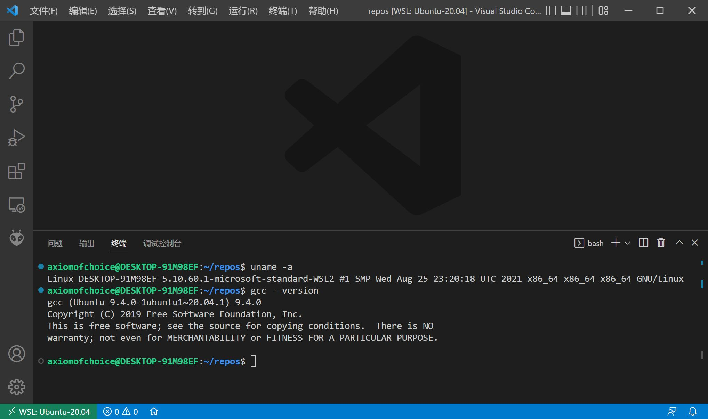

某天深夜，我在床上水裙，发现竟有裙友说出三异或的交换效率最高，而且在我纠正后没有裙友理我。

我觉得这可能只是少数人的错误认知。

本来这事情也就过去了，今天又看到有人代码里写三异或，看来 oier / acmer 群体这方面的误解很深啊，必须来写个文章解释一下。

正巧最近学了点汇编，本着授人以渔的想法，就稍微演示一下如何用汇编分析代码吧。

***

先打开一个 Linux 环境（这里用 vscode 连接了 WSL），如果没有 Linux 环境，WSL 安装起来炒鸡方便，建议 WSL。如果没有 gcc / objdump，而且是 ubuntu（其他不会），可以 `sudo apt install build-essential` 来安装。

linux / gcc 版本如下：



然后写一下我们要测试的 4 种交换写法，保存为 test.cpp

```cpp
#include <algorithm>

void xor_swap(int &a, int &b) {
    a ^= b;
    b ^= a;
    a ^= b;
}

void add_sub_swap(int &a, int &b) {
    a = a + b;
    b = a - b;
    a = a - b;
}

void mov_swap(int &a, int &b) {
    int t = a;
    a = b;
    b = t;
}

void std_swap(int &a, int &b) { std::swap(a, b); }
```

编译到目标文件，使用 oi / acm 界最牛的优化层级 -Ofast

```sh
gcc -Ofast -c test.cpp
```

运行完这个命令，会在当前目录生成一个 test.o，即目标文件。它是二进制的，我们可以用反汇编工具 objdump 来转换为人类可读的汇编代码

```sh
objdump -d test.o > test.o.txt
```

然后查看 test.o.txt

```text
test.o:     file format elf64-x86-64


Disassembly of section .text:

0000000000000000 <_Z8xor_swapRiS_>:
   0: f3 0f 1e fa           endbr64 
   4: 8b 07                 mov    (%rdi),%eax
   6: 33 06                 xor    (%rsi),%eax
   8: 89 07                 mov    %eax,(%rdi)
   a: 33 06                 xor    (%rsi),%eax
   c: 89 06                 mov    %eax,(%rsi)
   e: 31 07                 xor    %eax,(%rdi)
  10: c3                    retq
  11: 66 66 2e 0f 1f 84 00  data16 nopw %cs:0x0(%rax,%rax,1)
  18: 00 00 00 00 
  1c: 0f 1f 40 00           nopl   0x0(%rax)

0000000000000020 <_Z12add_sub_swapRiS_>:
  20: f3 0f 1e fa           endbr64 
  24: 8b 06                 mov    (%rsi),%eax
  26: 03 07                 add    (%rdi),%eax
  28: 89 07                 mov    %eax,(%rdi)
  2a: 2b 06                 sub    (%rsi),%eax
  2c: 89 06                 mov    %eax,(%rsi)
  2e: 29 07                 sub    %eax,(%rdi)
  30: c3                    retq
  31: 66 66 2e 0f 1f 84 00  data16 nopw %cs:0x0(%rax,%rax,1)
  38: 00 00 00 00 
  3c: 0f 1f 40 00           nopl   0x0(%rax)

0000000000000040 <_Z8mov_swapRiS_>:
  40: f3 0f 1e fa           endbr64 
  44: 8b 07                 mov    (%rdi),%eax
  46: 8b 16                 mov    (%rsi),%edx
  48: 89 17                 mov    %edx,(%rdi)
  4a: 89 06                 mov    %eax,(%rsi)
  4c: c3                    retq
  4d: 0f 1f 00              nopl   (%rax)

0000000000000050 <_Z8std_swapRiS_>:
  50: f3 0f 1e fa           endbr64 
  54: 8b 07                 mov    (%rdi),%eax
  56: 8b 16                 mov    (%rsi),%edx
  58: 89 17                 mov    %edx,(%rdi)
  5a: 89 06                 mov    %eax,(%rsi)
  5c: c3                    retq
```

可以看到，忽略没什么用的指令后，xor_swap 实际上编译成了这 7 个语句

```text
mov    (%rdi),%eax
xor    (%rsi),%eax
mov    %eax,(%rdi)
xor    (%rsi),%eax
mov    %eax,(%rsi)
xor    %eax,(%rdi)
retq
```

考虑到读者可能看不懂汇编，这里解释一下

`mov a b` 可以看成 c++ 的 `b = a;`

`xor a b` 可以看成 c++ 的 `b ^= a;`

`%rdi %rsi %eax` 表示寄存器

`(%rdi)` 表示 rdi 寄存器作为地址，间接访问内存

`retq` 表示函数栈 pop，并将 pop 出来的地址作为下一条指令，一般函数结束时会有这个指令

因此这个汇编代码可以类似地用 c++ 代码表示为：（用 mem 数组表示内存）

```cpp
int mem[114514];
int rdi, rsi, eax, edx;
void xor_swap() {
    eax = mem[rdi];   // mov    (%rdi),%eax
    eax ^= mem[rsi];  // xor    (%rsi),%eax
    mem[rdi] = eax;   // mov    %eax,(%rdi)
    eax ^= mem[rsi];  // xor    (%rsi),%eax
    mem[rsi] = eax;   // mov    %eax,(%rsi)
    mem[rdi] ^= eax;  // xor    %eax,(%rdi)
    return;           // retq
}
```

（当然一般内存是以字节编址的，这里 mem 用 int 4 字节编址，不能代表真实内存）

明眼人可能就看出来了，这不就是交换了 `mem[rdi]` 和 `mem[rsi]` 吗。然后再看一下另外 3 个函数，发现它们的功能也是如此。

我们再来用类似的方法分析一下 mov_swap（mov_swap 和 std_swap 的汇编是一样的，这是因为 `std::swap` 几乎就是这么实现）

```cpp
int mem[114514];
int rdi, rsi, eax;
void xor_swap() {
    eax = mem[rdi];  // mov    (%rdi),%eax
    edx = mem[rsi];  // mov    (%rsi),%edx
    mem[rdi] = edx;  // mov    %edx,(%rdi)
    mem[rsi] = eax;  // mov    %eax,(%rsi)
    return;          // retq
}
```

最后的结论那肯定是，6 个指令怎么可能打得过 4 个 mov 指令。（更：详细的解释是，这 10 个指令都是访存指令，xor_swap 访存地址覆盖了 mov_swap 访存地址，且 mov 和 xor 周期数一致，都是 1 周期。所以 mov_swap 更快。不过就算理论上再怎么无懈可击，最好还是实际测试一下吧）

***

后来又看了一下 `std::tie(a, b) = std::make_pair(b, a);` 的汇编，发现也是 4 个 mov 指令。

***

关于性能测试：不知道 bench 代码怎么写（担心 cache 会干扰），应该有专门工具的吧没了解过。

***

godbolt 网站可以直接看汇编，非常方便。
