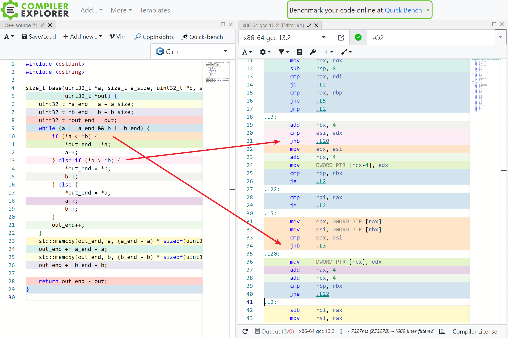
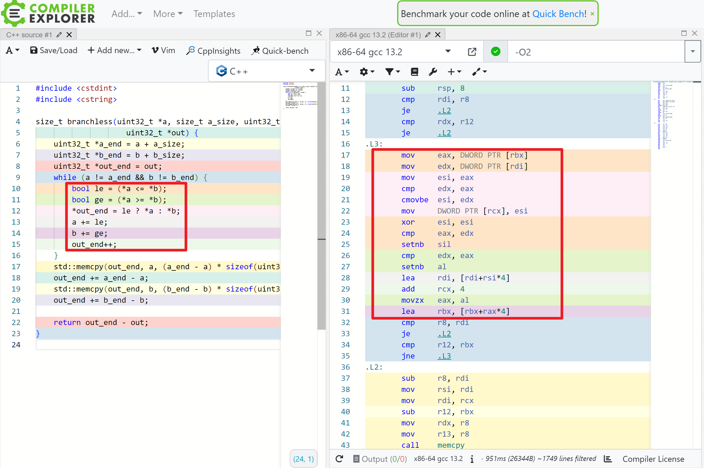

偶然遇到一个问题：给定两个集合，求它们的并集。集合用有序的整数 (uint32) 序列表示。

这个问题看似简单，实则有很大的优化空间，整个过程也非常有意思。

本文将从分支、SIMD、并发三个优化角度进行讲解。

## 1. 朴素方法

其实这个问题和归并操作差不多，差别在于是否会去重。仿照归并操作，我们可以写出下面的代码：

```cpp
size_t base(uint32_t *a, size_t a_size, uint32_t *b, size_t b_size,
            uint32_t *out) {
    uint32_t *a_end = a + a_size;
    uint32_t *b_end = b + b_size;
    uint32_t *out_end = out;
    while (a != a_end && b != b_end) {
        if (*a < *b) {
            *out_end = *a;
            a++;
        } else if (*a > *b) {
            *out_end = *b;
            b++;
        } else {
            *out_end = *a;
            a++;
            b++;
        }
        out_end++;
    }
    std::memcpy(out_end, a, (a_end - a) * sizeof(uint32_t));
    out_end += a_end - a;
    std::memcpy(out_end, b, (b_end - b) * sizeof(uint32_t));
    out_end += b_end - b;

    return out_end - out;
}
```

朴素实现有个很明显的性能问题，那就是两个 if 都生成了 jump 指令，如下图：



我们知道，CPU 对分支（jump 指令）预测失败会有 10-20 个时钟周期的惩罚，这会带来很大的开销。除非 if 内的表达式大概率为某个值（真或者假），否则还是尽可能把它优化掉。因此就有了 branchless 版本。

（perf 统计一个函数内（而不是整个程序）的分支 miss 率有点麻烦，不知道有没有简单的方法。反正不是工作，就不统计了）

## 2. branchless

灵感来源：[SIMDSetOperations](https://github.com/tetzank/SIMDSetOperations)

我们知道，`a++` 是否执行取决于 `*a <= *b` 这个条件，那么是不是可以改写成 `bool le = (*a <= *b); a += le;`。（其实，如果编译器足够强，是可以帮我把朴素方法优化成 branchless，只是今天还做不到）

不废话了，直接看代码：

```cpp
size_t branchless(uint32_t *a, size_t a_size, uint32_t *b, size_t b_size,
                    uint32_t *out) {
    uint32_t *a_end = a + a_size;
    uint32_t *b_end = b + b_size;
    uint32_t *out_end = out;
    while (a != a_end && b != b_end) {
        bool le = (*a <= *b);
        bool ge = (*a >= *b);
        *out_end = le ? *a : *b;
        a += le;
        b += ge;
        out_end++;
    }
    std::memcpy(out_end, a, (a_end - a) * sizeof(uint32_t));
    out_end += a_end - a;
    std::memcpy(out_end, b, (b_end - b) * sizeof(uint32_t));
    out_end += b_end - b;

    return out_end - out;
}
```

生成的部分汇编代码如下：



可以看到，while 内部已经一个 jump 指令都没了。

1. le, ge 这两个布尔变量可以用 setnb 指令来得到。
2. `*out_end = le ? *a : *b;` 这条语句是通过 cmovbe 指令（条件 mov）来实现的。

那么性能如何呢？考虑随机生成的 $2\times 10^7$ 大小的两个数组，结果是 base: 160.545750 (ms)，branchless: 82.300270 (ms)。branchless 获得了大致一倍的性能提升，非常好用。

如果 branchless 抛弃 C++ 而用汇编写，性能还能再压榨一些。比如 `cmp setnb cmp setnb` 可以优化为 `cmp setna setnb`，少一次冗余的比较。但不管怎么说，只考虑单核的话，branchless 已经基本触及**标量**计算的极限了。想要进一步优化，必须引入向量化（SIMD）。

## 3. SIMD

灵感来源还是：[SIMDSetOperations](https://github.com/tetzank/SIMDSetOperations)

单核 CPU 具有一次性处理多个数据的能力。比如说 SSE 一次性可以处理 128 bit，这 128 bit 可以是 2 个 64 位整数或 double，4 个 32 位整数或 float，等等。类似的，AVX2 的长度是 256 bit，AVX512 的长度是 512 bit。（SSE / AVX2 / AVX512 都是 intel 处理器的指令集）

这种操作就是 SIMD。

很多问题的 SIMD 优化其实都比较容易实现，但是这篇文章探讨的问题就不太容易看出来。这也是 SIMD 强大之处。

### 3.1. 整体思路

假设我们使用 SSE（一次处理 4 个 32 位整数）。

先取 a, b 数组的前 4 个数，对它们进行排序。较小的 4 个去重后放到 out 数组里，较大的 4 个数字记为 tmp。

然后不断地取 a, b 里首个数字较小的 4 个数，和 tmp 进行归并排序。较小的 4 个去重后放到 out 数组里，较大的 4 个数字记为 tmp。以此类推。

### 3.2. 排序

假设 a, b 都是 4 个**有序**整数，排序后较小 4 个数放回 a，较大 4 个数放回 b。这操作非常奇技淫巧。

先介绍两个指令：

- 求 a, b 各个位置的最小值，`_mm_min_epu32(a, b)` ，效果等同于：

```cpp
// 并不能这么写，这里只是方便讲解
for (int i = 0; i < 4; i++) { c[i] = std::min(a[i] + b[i]); }
```

- 循环右移，`_mm_shuffle_epi32(a, _MM_SHUFFLE(2, 1, 0, 3))`，效果等同于：

```cpp
std::tie(a[0], a[1], a[2], a[3]) = std::make_tuple(a[3], a[0], a[1], a[2]);
```

ps: `_MM_SHUFFLE(2, 1, 0, 3)` 倒过来是 3 0 1 2，和 make_tuple 里的下标对应。

于是我们可以**重复**以下操作 **4** 次：

1. `_mm_min_epu32(a, b)`，`_mm_max_epu32(a, b)` 赋值给 a, b
2. b 循环右移

很难解释这个为什么能排序，算了反正没什么人看到这（

### 3.3. 去重

首先对 a 进行循环右移，结果为 a'。

然后对 a 和 a' 各个位置进行等于的比较（_mm_cmpeq_epi32）。4 个位置等于 / 不等于，可以得到 $2^4=16$ 个结果。

在[开源实现](https://github.com/tetzank/SIMDSetOperations/blob/master/union/sse.hpp)里会有一个初始化，对这 16 个结果进行编码，得到一个 shuffle 数组。这样就可以一个 _mm_shuffle_epi8 指令就能去重了。

### 3.4. 分析

事实上[开源实现](https://github.com/tetzank/SIMDSetOperations/blob/master/union/sse.hpp)还有亿些细节，代码也很长就不展示了，感兴趣可以去研究。

实测 SSE 的表现是 40.156805 (ms)，性能是朴素实现的 4 倍。当然选择更宽的向量指令集效果肯定更好。

## 4. 并发

最终，我们来到了多个 CPU 的领域。

在这个问题中，并发这件事就会稍复杂一些。假设我们把 a 数组均分为 n 部分，那么 b 数组对应的就不是均分的了。

所以我们需要一个很经典的算法，那就是力扣上的[寻找两个正序数组的中位数](https://leetcode.cn/problems/median-of-two-sorted-arrays/description/)。我们用类似算法可以求两个有序数组的 n 等分点，这样的话，就能直接并发了。

万万没想到力扣算法有一天也会这么实用（
