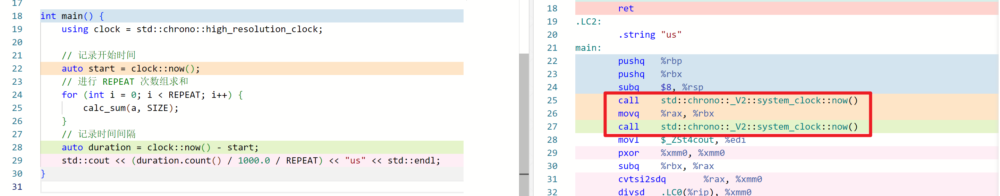
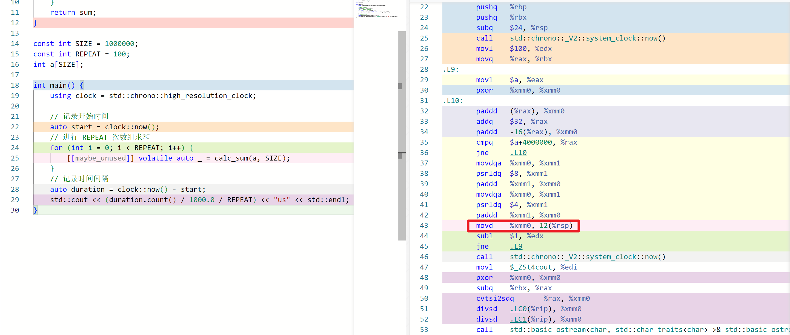
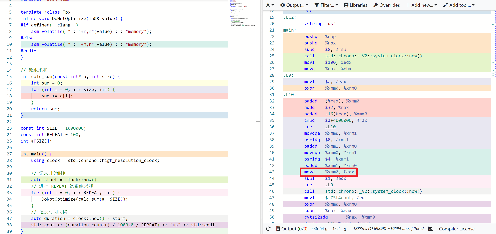
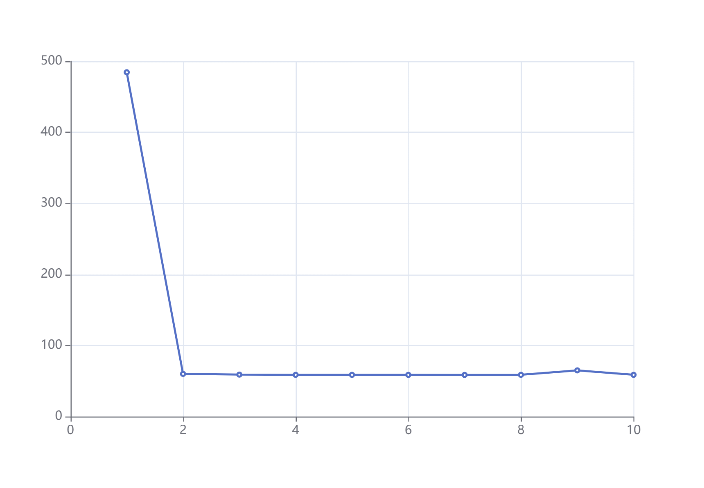

最近看了一眼 google benchmark ([https://github.com/google/benchmark](https://github.com/google/benchmark)) 的文档，还是能学到不少东西的，所以打算讲一讲 benchmark 的寄巧。

## 1. 名词解释

benchmark：基准测试，一般指对独立模块的性能测试。

## 2. 一个基础实现

假设我们需要测量**数组求和**的性能，可以进行 REPEAT 次数组求和，并在其前后获取系统时间，代码如下：

```cpp
#include <chrono>
#include <cmath>
#include <iostream>

// 数组求和
int calc_sum(const int *a, int size) {
    int sum = 0;
    for (int i = 0; i < size; i++) {
        sum += a[i];
    }
    return sum;
}

const int SIZE = 1000000;
const int REPEAT = 100;
int a[SIZE];

int main() {
    using clock = std::chrono::high_resolution_clock;

    // 记录开始时间
    auto start = clock::now();
    // 进行 REPEAT 次数组求和
    for (int i = 0; i < REPEAT; i++) {
        calc_sum(a, SIZE);
    }
    // 记录时间间隔
    auto duration = clock::now() - start;
    std::cout << (duration.count() / 1000.0 / REPEAT) << "us" << std::endl;
}
```

`std::chrono::high_resolution_clock::now()` 可以获取当前时间，两个时间相减后调用 `.count()` 就能得到纳秒，除以 1000 就得到微秒。

## 3. 阻止优化

上面的代码会有个问题，如果开了 -O2 优化，运行结果**可能**只有 0.001us。

原因是 for 循环没有副作用，被编译器给优化掉了。[godbolt 链接](https://godbolt.org/z/E8E76bG1Y)，如下图红框的位置，两次 `std::chrono::_V2::system_clock::now()` 调用之间只有个 mov 指令，这显然不是我们想要的。



***

一种方法是把结果写到局部 volitile 变量里。

```cpp
// 进行 REPEAT 次数组求和
for (int i = 0; i < REPEAT; i++) {
    [[maybe_unused]] volatile auto _ = calc_sum(a, SIZE);
}
```

下图中编译器保留了 sum 的求值过程，求值结果会被写到栈内存里（`movd %xmm0, 12(%rsp)`）。



***

另一个是 benchmark 库提供的方法，用内嵌汇编让编译器认为你需要用到这个值，实际上内嵌了空的汇编。

```cpp
template <class Tp>
inline BENCHMARK_ALWAYS_INLINE void DoNotOptimize(Tp&& value) {
#if defined(__clang__)
  asm volatile("" : "+r,m"(value) : : "memory");
#else
  asm volatile("" : "+m,r"(value) : : "memory");
#endif
}
```

下图中，DoNotOptimize 变成了一个 mov 指令。（godbolt 上 DoNotOptimize 对应了好几条指令，不知道为啥）



## 4. 误差分析

即使是同一个 benchmark 程序，测得的时间也不是固定的。所以需要测多轮 benchmark，求标准差 / 变异系数（标准差与平均值的比值），来判断误差是否可接收。

google benchmark 提供了这个[功能](https://github.com/google/benchmark/blob/main/docs/user_guide.md#statistics-reporting-the-mean-median-and-standard-deviation--coefficient-of-variation-of-repeated-benchmarks)。

## 5. cache 处理

我们知道，访问一段内存后，这部分数据可能会留在 cache 里，下次访问的速度会有提升。如果数据在 cache 里，称 cache 是热的，反之就是冷的。

以数组求和为例，将代码改成每次求和输出一次时间（[完整代码](https://godbolt.org/z/1s1s4Yjoa)），就可以得到 484.5us 60us 59us 58.7us 58.7us 58.7us 58.6us 58.7us 65us 58.7us（本地跑的数据）。



***

当我们想要模拟热的 cache，那么只要在 benchmark 前增加个热身 (warmup) 过程，即先跑个几次把 cache 热起来。

```cpp
const int SIZE = 1000000;
const int WARMUP = 10;
const int REPEAT = 100;
int a[SIZE];

int main() {
    using clock = std::chrono::high_resolution_clock;

    // 热身
    for (int i = 0; i < WARMUP; i++) {
        DoNotOptimize(calc_sum(a, SIZE));
    }
    // 记录开始时间
    auto start = clock::now();
    // 进行 REPEAT 次数组求和
    for (int i = 0; i < REPEAT; i++) {
        DoNotOptimize(calc_sum(a, SIZE));
    }
    // 记录时间间隔
    auto duration = clock::now() - start;
    std::cout << (duration.count() / 1000.0 / REPEAT) << "us" << std::endl;
}
```

（[完整代码](https://godbolt.org/z/MWfo5jn1j)，热 cache 跑出来结果约为 60us）

***

当我们想要模拟冷的 cache，就会稍微复杂一些。

一种方法是跑一遍就往无关的内存读写，将 cache 替换掉。但是这种方法需要暂停和恢复计时，这会引入一定的偏差。所以这里介绍一个循环

首先 linux 下用 lscpu 看一下 L3 cache 容量，用常量记录一下，我电脑上 L3 是 16 MiB：

```cpp
const int L3CAP = 16 * 1024 * 1024;
```

反复申请大小为 SIZE 的数组，直到大于 L3 cache 容量的两倍：

```cpp
size_t total_size = 0;
std::vector<std::vector<int>> list;
while (total_size < L3CAP * 2) {
    std::vector<int> element(SIZE);
    total_size += element.size();
    list.push_back(std::move(element));
}
```

shuffle 一下，让硬件预取一定程度上失效（不知道有没有用）：

```cpp
std::shuffle(blocks.begin(), blocks.end(), std::mt19937());
```

按顺序填充 0，一个是防止 benchmark 时出现缺页（std::vector 已经填充过 0 了，对其他数据结构可能需要），另一个是刷新一下 cache。

```cpp
for (auto& block : blocks) {
    std::fill(block.begin(), block.end(), 0);
}
```

（[完整代码](https://godbolt.org/z/WWs7osjrr)，冷 cache 跑出来结果约为 240us）

***

数据在 L3 cache 里但不在 L2 cache 里，也可以调整代码实现。

## 6. random interleaving

[原文](https://github.com/google/benchmark/blob/main/docs/random_interleaving.md)

如果有多种不同的测试，通过随机排列可以降低偏差（原文说降低 40%）

google benchmark 提供了这个功能。

## 7. perf 计数

除了运行时间，其他数据（比如 cpu 周期）也是重要的指标。

一般使用命令行 perf stat 会统计整个程序的 perf 计数，但我们并不想统计初始化和卸载的 perf 计数。一种方法是统计一下只有初始化和卸载的 perf 计数，从结果里减掉这个值；另一种方法就是用 perf_event_open 接口。google benchmark 帮我们封装了 perf_event_open。

如何用 perf 分析以及相关 PMU 工具，这个就不是本文的范围了。

## 8. 其他

[LLVM Benchmarking tips](https://llvm.org/docs/Benchmarking.html) 讲了关闭 cpu 频率缩放、关闭超线程、cpu 隔离等措施，可以把性能偏差降低到 0.1%。
