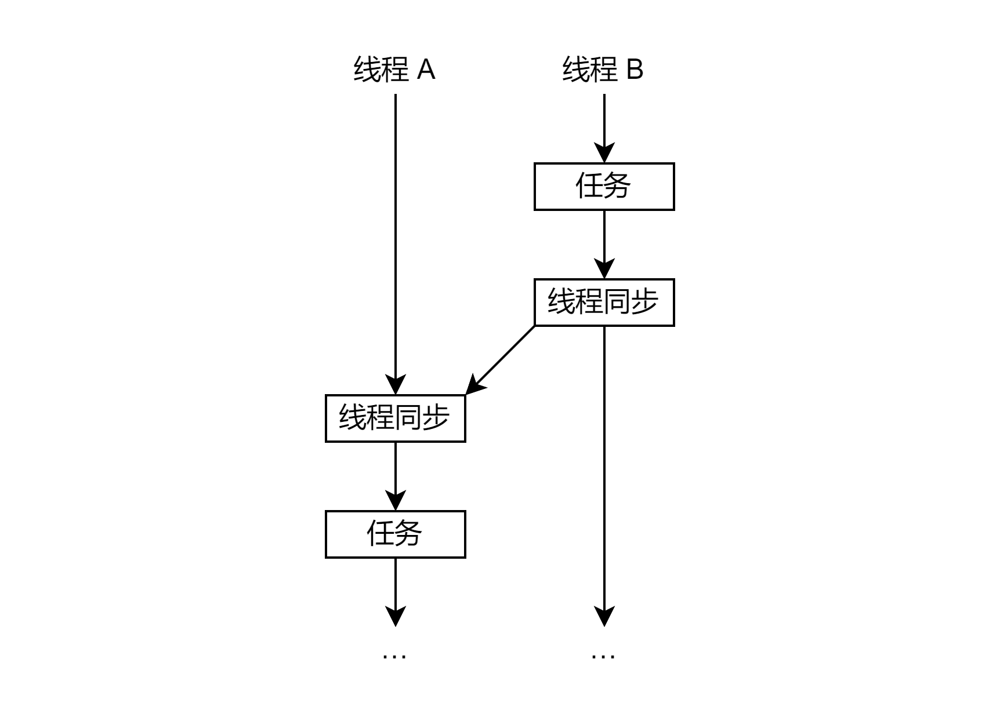
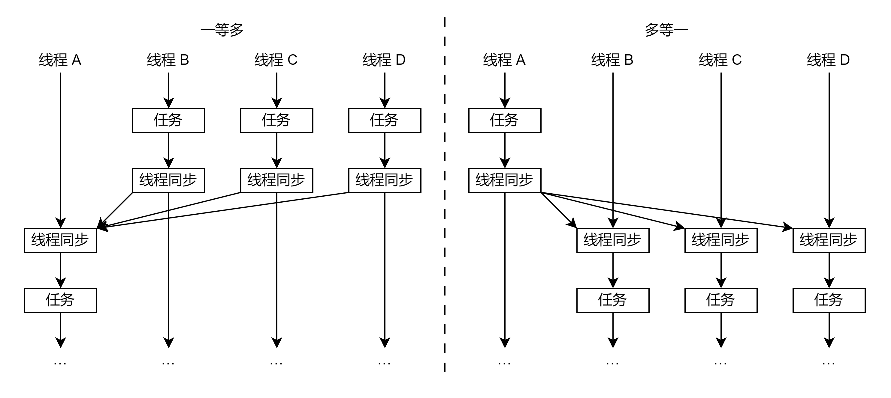
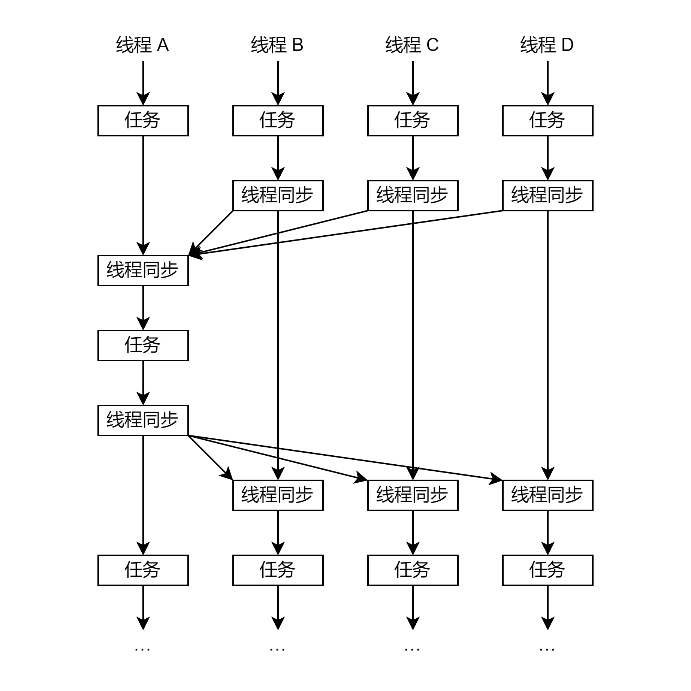
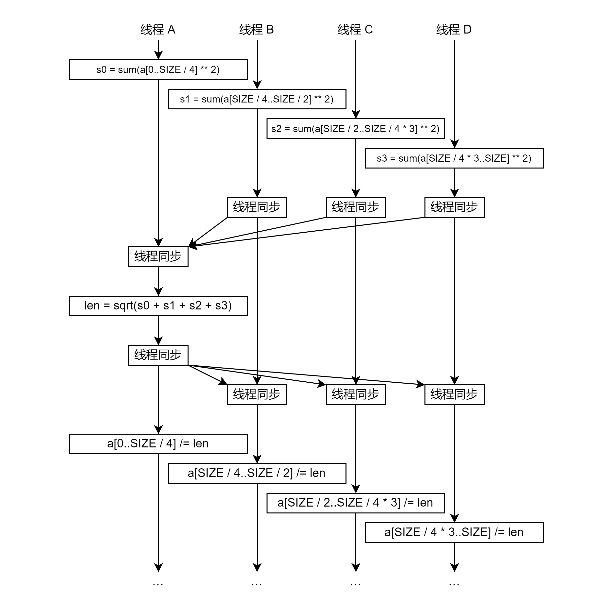

前置芝士：C++ 原子。

在高性能场景，一般会用 OpenMP 来实现多线程功能。如果，我们想要做的更加极致，还有没有优化空间？

答案是肯定的。

为了降低难度，本文**不讲内存模型**，也不讲 OpenMP。

## 1. 线程同步

有时，线程 B 的任务完成后，线程 A 的任务才能开始。所谓线程同步，就是线程 A 等待线程 B 的这个过程。



上图中，箭头表示事件发生的先后顺序。

线程更多时，问题可扩展为线程 A 等待线程 B,C,D,...，或者线程 B,C,D,... 等待线程 A。本文将这两种情况称为一等多和多等一。如下图：



多等一，可以用来作为单线程转变为多线程的过程，而多等一则相反。

显然，还有多等多的情况，这个在下文讲。

### 1.1. 一等多

既然标题是用户态，那自然是用原子实现，这里有两个实现。

一个是用 8 个（假设有 8 个线程）原子变量来表示每个线程的状态，让线程 0 不断读其他线程的状态，从而达到阻塞的目的。

另一个是非 0 线程都原子加 (atomic add) 到一个变量上，线程 0 不断检查这个变量是否等于 7。

这里只用第一个方式，具体哪个快我也不知道。

```cpp
#include <chrono>
#include <iostream>
#include <thread>

const int64_t N_THREADS = 8;

struct alignas(128) SyncWorkspace {
    std::atomic<uint64_t> state;
};
SyncWorkspace workspace[N_THREADS] = {};
std::thread threads[N_THREADS];

void sync_1w7(int64_t thread_id) {
    if (thread_id != 0) {
        // 非 0 线程等 2 秒再打印线程编号，然后线程同步
        std::this_thread::sleep_for(std::chrono::seconds(2));
        std::cout << std::to_string(thread_id) + "\n";
        workspace[thread_id].state.store(1);
    }
    if (thread_id == 0) {
        // 线程 0 先线程同步再打印线程编号
        for (int64_t i = 1; i < N_THREADS; i++) {
            while (workspace[i].state.load() != 1);
        }
        std::cout << std::to_string(thread_id) + "\n";
    }
}

int main() {
    for (int64_t i = 0; i < N_THREADS; i++) {
        threads[i] = std::thread(sync_1w7, i);
    }
    for (int64_t i = 0; i < N_THREADS; i++) {
        threads[i].join();
    }
    return 0;
}
```

有几个注意点：

1. `thread_id` 在这里不是操作系统的线程 id，只是从 0 开始的编号。
2. 为了避免伪共享 (false sharing)，原子变量应以两倍 cacheline 对齐（128 字节对齐），体现在代码里是 `alignas(128)`。伪共享是什么就不细嗦了。
3. 本文**不讲内存模型**，所以用默认也是最强的内存模型 seq_cst。当然也可以用 acquire、release，懂的自然都懂，不懂的也不用管，只要知道线程同步用原子就对了。

### 1.2. 多等一

多等一也有两个实现。

一个是 1 个原子变量表示线程 0 的状态，非 0 线程检查这个变量。

另一个是用 8 个原子变量都表示线程 0 的状态，非 0 线程不断检查各自的原子变量。

同理，这里只用第一个方式，具体哪个快我也不知道。

```cpp
void sync_7w1(int64_t thread_id) {
    if (thread_id == 0) {
        // 线程 0 等 2 秒再打印线程编号，然后线程同步
        std::this_thread::sleep_for(std::chrono::seconds(2));
        std::cout << std::to_string(thread_id) + "\n";
        workspace[thread_id].state.store(1);
    }
    if (thread_id != 0) {
        // 非 0 线程先线程同步再打印线程编号
        while (workspace[0].state.load() != 1);
        std::cout << std::to_string(thread_id) + "\n";
    }
}
```

### 1.3. 多等多

在实践上，多等多一般用一等多 + 多等一来实现。如下图：



（**注意看**，线程 0 可以在中间插个单线程的任务）

除此之外还有亿些实现：

1. 多等一 + 一等多（把顺序换一下），缺点就是线程 0 不能在中间插个单线程的任务。
2. 用 N 个原子变量表示每个线程的状态，每个线程又检查其他所有线程。怎么感觉有点集合通讯内味了。

同理，我还是不知道什么更快。（为什么我又不知道哪个更快？因为这和平台有关）

## 2. 性能如何

非原子的实现会让不干活的线程进入阻塞状态，想要唤醒自然会慢一点。原子线程同步大部分情况可以认为是最快的，除非硬件针对线程同步提供了专门的指令（比如 GPU）。

估计耗时是几个微秒。

## 3. 那么代价是什么

占 CPU。

## 4. 例 向量归一化

向量归一化 (normalization)，就是把向量除以它的长度，从而得到这个方向的单位向量。公式为 $a_i\leftarrow \dfrac{a_i}{\sqrt{\sum_{j} a_j^2}}$。

我们很自然可以想到，多线程每个线程处理一部分数的平方和；然后单线程计算 len = 所有线程的结果加起来再开方；最后所有线程计算一部分数除以 len。

这个处理过程就是多线程 -> 单线程 -> 多线程的处理逻辑，套用一等多 + 多等一来实现即可。如下图：


