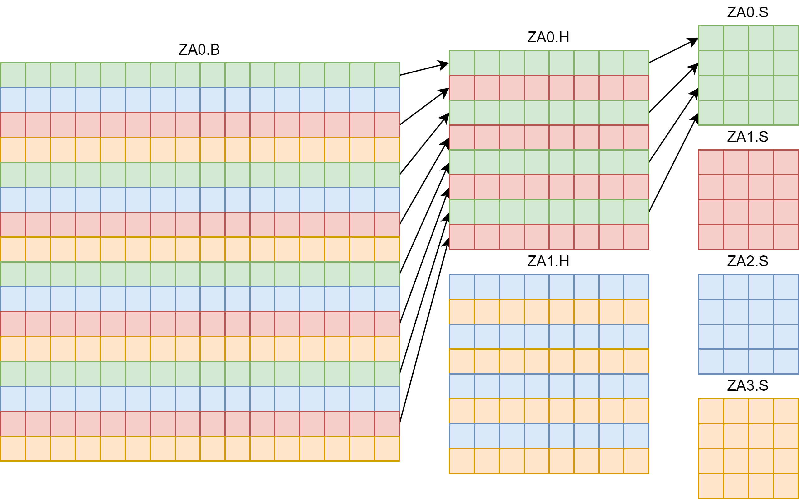
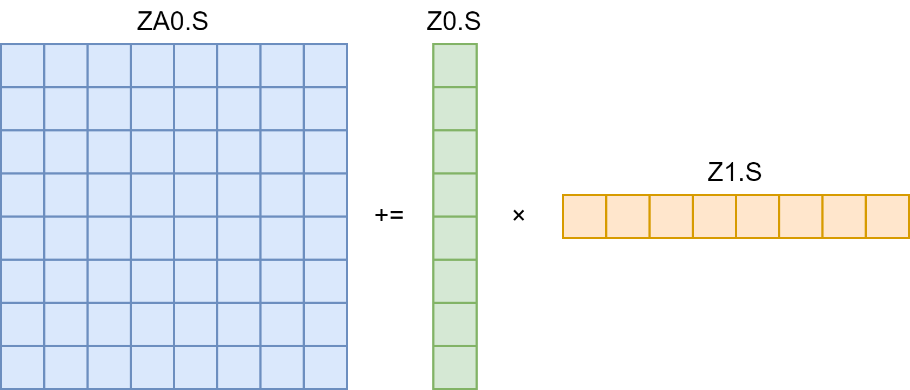
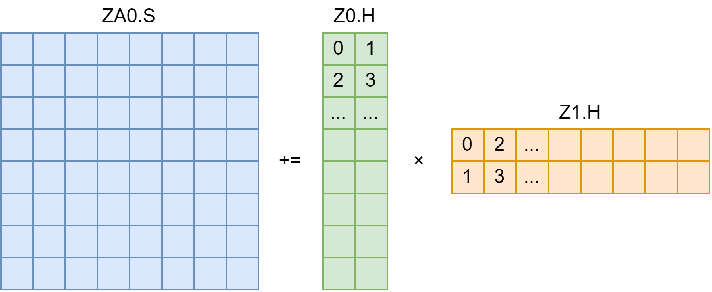

本文假设读者已掌握 SVE 指令集。

术语约定：Z 寄存器（向量寄存器），P 寄存器（预测寄存器），ZA 寄存器（矩阵寄存器）

## 1. ZA 寄存器

我们知道，SVE 指令集有两个重要的特点，一个是向量长度由平台决定，另一个是用预测寄存器（P 寄存器）来控制每个位置的运算。SME 也是如此。

首先是寄存器。SME 相比于 SVE 多了 ZA (Z Array) 寄存器（英文意思大概是 Z 寄存器排成数组），并且 ZA 和 Z 寄存器没有任何共用（比如浮点寄存器、NEON、SVE 的寄存器互相有共用，ZA 没有）。

假设 SVE 的一个 Z 寄存器是 VL 字节，那么 ZA 一共可存储 VL×VL 字节，根据不同的数据类型可分为：

1. `ZA0.B` 存储 8-bit 数据类型矩阵，矩阵排列成 VL 行 VL 列。
2. `ZA0.H, ZA1.H` 2 个存储 16-bit 数据类型矩阵，矩阵排列成 VL/2 行 VL/2 列。
3. `ZA0.S, ..., ZA3.S` 4 个存储 32-bit 数据类型矩阵，矩阵排列成 VL/4 行 VL/4 列。
4. `ZA0.D, ..., ZA7.D` 8 个存储 64-bit 数据类型矩阵，矩阵排列成 VL/8 行 VL/8 列。
5. `ZA0.Q, ..., ZA15.Q` 这个是 128-bit，用的不多，略。

以 32-bit 为例，矩阵大小是 (VL/4)×(VL/4)，矩阵元素 4 字节，乘起来得到一个矩阵存储 VL×VL/4 字节，因此这样的矩阵可以设计成 4 个。

下图是 VL=16 的 ZA 寄存器示意图：

由于 ZA 只有 VL×VL 字节，所以不同数据类型的 ZA 存在复用，比如 `ZA0.B` 和 `ZA0.H` 有复用的情况。具体复用的对应规则如上图颜色和箭头所示。

## 2. SME 指令

[这个网站](https://dougallj.github.io/asil/sme.html)可以查阅 SME 指令。

SME 主要有这么几类指令：

1. 只操作 Z 寄存器，这种指令是 SVE/SVE2 的补充，本文不涉及。
2. MOVA 指令，将 Z 寄存器搬运到 ZA 的某几行/列，或 ZA 的某几行/列搬运到 Z 寄存器。
3. 访存指令，将内存读到 ZA 的某一行/列，或 ZA 的某一行/列写到内存。可以用 SVE 访存 + MOVA 替代，这里就不细讲了。
4. ZA 局部计算指令，比如 ZA 的连续几行进行乘加运算，这种指令还不知道有哪些使用场景。
5. ZA 全局计算指令，这是本文的重点。

写 SME 代码有两种方式，一是用 ACLE (Arm C Language Extensions)，还有就是直接写汇编。考虑到 ACLE 每个函数和汇编基本上能一一对应，这里就用汇编来介绍。

### 2.1. MOVA 指令

举 4 个例子就好了：

1. `MOVA ZA0H.S[W12, 1], P0/M, Z0.S` ZA0.S 的第 W12+1 行（H 代表行）赋值为 Z0.S。
2. `MOVA ZA1V.S[W12, 2], P0/M, Z0.S` ZA1.S 的第 W12+2 列（V 代表列）赋值为 Z0.S。
3. `MOVA Z0.S, P0/M, ZA0H.S[W12, 1]` Z0.S 赋值为 ZA0.S 的第 W12+1 行（H 代表行）。
4. `MOVA Z0.S, P0/M, ZA1V.S[W12, 2]` Z0.S 赋值为 ZA1.S 的第 W12+2 列（V 代表列）。

仔细观察网站里的指令介绍，可以发现指令使用起来有很多约束（比如 ZA 行/列的索引，只能用 W12-W15），这是因为精简指令集的一个指令固定 4 字节，已经塞不下额外的东西了。

还有操作多行的 MOVA 指令，这里不讲。

### 2.2. MOPA 指令

ZA 全局计算指令很少，只有乘加指令 (MOPA) 和乘减指令 (MOPS)。

为什么要设计矩阵指令集：答案当然是加速矩阵乘。体现在指令上，一条指令需要尽可能让电路执行更多的计算（更严谨地，考虑 cycle）。

SVE 受寄存器的限制，只能让两个向量做乘加，得到一个向量，可以一次做 $O(\text{VL})$ 次计算。而 SME 有了矩阵寄存器，就可以让两个向量上各个位置互相乘，得到一个矩阵，可以一次做 $O(\text{VL}^2)$ 次计算。

先看 float 类型的 FMOPA：`FMOPA ZA0.S, P0/M, P1/M, Z0.S, Z1.S` Z0 第 i 个数乘以 Z1 第 j 个数，累加到 ZA0 的 i 行 j 列（i, j 由 P0, P1 控制）。事实上，Z0 可以看作 N×1 的矩阵，Z1 可以看作 1×N 的矩阵，它们做矩阵乘法再和 ZA0 相加，N=8 如下图：

如果是 float16 类型的 FMOPA，计算结果可以是 float，或者 float16。后者属于 SME 扩展 (FEAT_SME_F16F16)，虽然计算更密集，但是电路复杂、精度低，比较鸡肋，目前大概没有硬件实现。对于前者，`FMOPA ZA0.S, P0/M, P1/M, Z0.H, Z1.H`，我们要将 Z0 排成 N×2 的矩阵，Z1 排成 2×N 的矩阵（排列顺序是图中的数字），它们做矩阵乘法再和 ZA0 相加，N=8 如下图：

