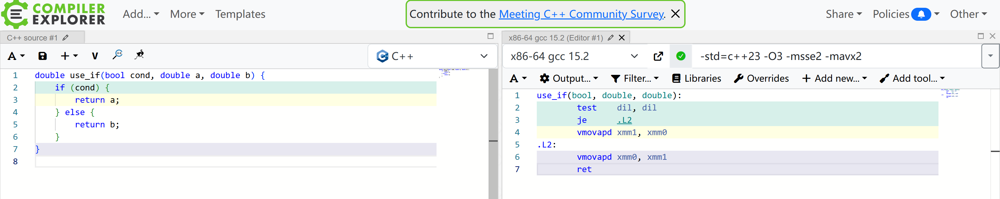

起因是群友同事不好好写代码，把 `if (flag) { res = 0.0; }` 写成 `res = static_cast<double>(!flag) * res;`。

简单来说就是可读性优先，选择第一种或者三目 `res = flag ? 0 : res;` 都可以接受。功能上如果 res = inf / nan 乘法会寄。虽然有分支，但是性能不会有很大差别，没必要抠这点性能。

过早的优化是万恶之源。—— Donald Knuth 等人, 1974

***

虽然没必要抠性能，但架不住很有意思啊。

我们知道分支惩罚是大概 15-20 个 CPU 周期，常见 CPU double 乘法的 latency 是 4 个，分支命中率至少 75% 才能性能接近。这就取决于程序是否分支友好（例如矩阵乘能有很高的命中率，而排序就不行）。

这里可能有人要说，三目运算符不是可以优化为 cmov 吗，为什么还有分支。这就不得不提 x86 cmov 只支持通用寄存器，导致 GCC 强烈地倾向于使用分支。

## 1. 优化尝试

除了这两种写法，我们很快能想到一些思路，比如使用 `std::bit_cast` 转换成整数、bitand、sse blend 指令（sse 是 x86 的 SIMD 指令集，blend 可以理解为 SIMD 版三目运算）等，必要时可以内联汇编。

***

这里默认编译器 x86-64 GCC 15.2，编译参数 `-std=c++20 -O3 -march=skylake -msse4.2 -mavx2`。

为了避开内存读写开销，我定义了这样的函数接口，图里可以看到 je 这个跳转指令（分支）就是性能问题所在：

```cpp
double use_if(bool cond, double a, double b) {
    if (cond) {
        return a;
    } else {
        return b;
    }
}
```



但是需要注意的是，单独的函数有分支不代表放到循环里有分支，所以单独函数的汇编意义不是很大了。

然后是乘法和其他的一些写法：

```cpp
// 对照
double do_nothing(bool cond, double a, double b) {
    DoNotOptimize(cond);
    return a + b;
}

// 乘法是没有分支的
double use_mul(bool cond, double a, double b) { return a * cond + b * (!cond); }

double use_cond_op(bool cond, double a, double b) { return cond ? a : b; }

// bit_cast + 三目运算，有分支
double use_bit_cast_and_cond_op(bool cond, double a, double b) {
    return std::bit_cast<double>(cond ? std::bit_cast<int64_t>(a)
                                      : std::bit_cast<int64_t>(b));
}

// bit_cast + bitand（GCC 编译无分支，ICC 有分支）
double use_bit_cast_and_bit_and(bool cond, double a, double b) {
    return std::bit_cast<double>(
        (std::bit_cast<int64_t>(a) & -static_cast<int64_t>(cond)) |
        (std::bit_cast<int64_t>(b) & ~-static_cast<int64_t>(cond)));
}

// 标准的 simd，被反向优化成了分支
double use_std_simd(bool cond, double a, double b) {
    namespace stdx = std::experimental;
    using simd_t = stdx::simd<double>;
    using simd_mask_t = stdx::simd_mask<double>;
    simd_t va(a);
    simd_t vb(b);
    simd_mask_t vm(cond);
    stdx::where(vm, vb) = va;
    return vb[0];
}

// 手动 sse intrinsics，无分支
double use_sse_blend(bool cond, double a, double b) {
    __m128d va = _mm_set1_pd(a);
    __m128d vb = _mm_set1_pd(b);
    return _mm_cvtsd_f64(_mm_blendv_pd(
        vb, va, _mm_castsi128_pd(_mm_set1_epi64x(cond ? -1 : 0))));
}

// 内联汇编 cmov，无分支
double use_asm_cmov(bool cond, double a, double b) {
    int64_t a_bits = std::bit_cast<int64_t>(a);
    int64_t b_bits = std::bit_cast<int64_t>(b);
    asm volatile(
        "test %[cond], %[cond]\n"
        "cmove %[b_bits], %[a_bits]\n"
        : [a_bits] "+r"(a_bits)
        : [cond] "r"(cond), [b_bits] "r"(b_bits)
        : "cc");
    return std::bit_cast<double>(a_bits);
}
```

评论区 YandereChan 提供了一个不错的方法（性能有前三的水平）：

```cpp
double use_arr(bool cond, double a, double b)
{
    double ret[]{b, a};
    return ret[(std::size_t)cond];
}
```

我看了一下基于数组的测试 ICC 汇编，每次循环 use_asm_cmov 有 6 次访存（其实 4 次就够了），use_arr 7 次（double 数组导致的）。ai 说 cmov 的指令依赖链更长，感觉确实是这样，只能说编译器不够聪明，都没优化到极致。

## 2. 基于数组的测试

分支命中率对性能结果会有很大影响，因此最好的做法是分别测出 100% 和 50% 命中率的性能，这样就能拟合出任意命中率的性能了。50% 命中率可以用随机数来防止分支预测干预。

所以我随机生成 5000 组数据作为输入，实测小于 5000 分支预测器仍然有效（我用 perf 抓了分支 miss 率）：

```cpp
struct Case {
    bool cond;
    double a;
    double b;
};

std::vector<Case> cases;

template <typename Func>
void loop(Func func) {
    for (auto& c : cases) {
        double res = func(c.cond, c.a, c.b) + c.a + c.b;
        DoNotOptimize(res);
    }
}
```

上面代码为什么有 `+ c.a + c.b`，因为本来写的 `DoNotOptimize(c.a); DoNotOptimize(c.b)` 被 ICC 无视了（ICC 会优化成 `c.a` 和 `c.b` 选择读一个，比别的方法少一次读，性能快得飞起；但是如果 `+ c.a + c.b` 又变成分支了，很奇怪）。

[完整代码](https://godbolt.org/z/rMvqrffrr)

| | GCC / ns | ICC / ns |
| :-: | :-: | :-: |
| do_nothing | 1.50 | 1.19 |
| use_if | 3.46 | 3.98 |
| use_mul | 1.68 | 2.36 |
| use_cond_op | 3.50 | 3.79 |
| use_bit_cast_and_cond_op | 3.48 | 4.08 |
| use_bit_cast_and_bit_and | 1.48 | 3.69 |
| use_std_simd | 3.83 | 2.65 |
| use_sse_blend | 1.81 | 1.02 |
| use_asm_cmov | 1.52 | 1.01 |

可以看到，只要是 branch-less 的写法就能有很高的效率，如果要极致的效率，还得是手动优化 + intel 的高性能优化编译器。但是如果不需要，GCC 就能兜底。

如果分支命中率 100%，实测 use_if 是 1.25 ns 左右，这样可以算出 90% 的命中率才能和 use_mul 性能接近。

## 3. 基于 LCG 的测试

由于读内存或多或少有些干扰，我仿照 LCG（线性同余发生器）写了一个测试：

```cpp
template <typename Func>
void loop(Func func) {
    uint64_t prev = 114514;
    uint64_t dummy = 1919810;
    for (size_t i = 0; i < SIZE; ++i) {
        bool cond = (dummy >> 32) % 2 == 0;
        double a = std::bit_cast<double>(prev);
        double b = std::bit_cast<double>(dummy);
        double res = func(cond, a, b);
        DoNotOptimize(res);
        prev = dummy;
        dummy = dummy * 114514123463 + (std::bit_cast<uint64_t>(res) >> 32);
    }
    DoNotOptimize(dummy);
}
```

除了不访问内存，还让结果影响下一次的输入（指令依赖），这样可以让高延时算法的缺陷暴露出来。

[完整代码](https://godbolt.org/z/nhKf4oTe6)

| | GCC / ns | ICC / ns |
| :-: | :-: | :-: |
| do_nothing | 2.54 | 2.96 |
| use_if | 4.17 | 4.81 |
| use_mul | 5.91 | 6.10 |
| use_cond_op | 4.04 | 4.66 |
| use_bit_cast_and_cond_op | 3.99 | 4.67 |
| use_bit_cast_and_bit_and | 3.22 | 4.69 |
| use_std_simd | 4.30 | 5.28 |
| use_sse_blend | 3.63 | 2.87 |
| use_asm_cmov | 2.85 | 2.38 |

use_if 怎么比 use_mul 快了？没错，GCC 优化成了 cmov，这就是上文说的“单独的函数有分支不代表放到循环里有分支”。而 use_mul 乘法本身的延迟被暴露出来，成为最慢的算法。

***

对于这么小的几个函数，确实很难设计 benchmark 代码，我踩了不知道多少个坑，最后汇编正确、perf 正确、性能数据正确才放心。虽然不够专业，但还是希望能给大家一些实践建议。
