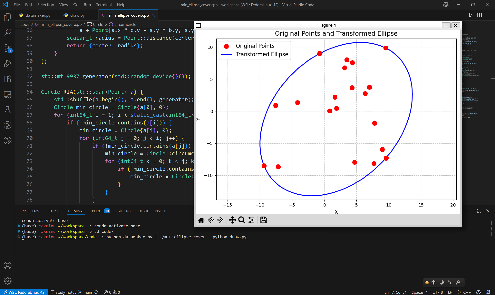

给 $n\le 20$ 个平面上的点，求最小面积覆盖的椭圆。题目出处是 NJUCS 机试的第二题（是保研的机试）（“我们的本科教育出了很大的问题”）<https://zhuanlan.zhihu.com/p/1946176384578856692>。

***

第一眼：由于 n 非常小，完全可以枚举所有 5 个点。我们知道圆锥曲线一般式 $Ax^2+Bxy+Cy^2+Dx+Ey+F=0$，直接设 A=1，把 5 个点代入就变成线性方程，高斯消元即可。但是问题恰恰不在 5 个点的情况，如果最优解的椭圆穿过 4 个点呢？3 个点呢？这样的椭圆就无法直接确定，变成难度更大的最优化问题，对于我这种人非常不友好。

因此这题想要快速完成，只能用类似梯度下降的算法做，这里采用最简单的爬山算法。我们可以把椭圆的圆心、长轴、短轴、旋转角度这些变量组成 5 维向量，在 5 维空间里随机游走。如果椭圆不包含所有点就撤销，如果椭圆面积比之前大也撤销。

另一个更好的做法就是文章里的，只要求一个最优的线性变换，在这个线性变换下求最小圆覆盖。这样就是 2 维空间随机游走了（因为只需要一个方向的缩放和剪切，其他的不影响椭圆面积），理论上效果会更好。

***

理论可行，实践开始。

我们要实现的是 Point 类，顺便把线性变换实现了：

```cpp
struct Point {
    scalar_t x;
    scalar_t y;
    // 向量加、减、标量乘、点积、叉积等函数
    // 这是线性变换
    static Point linear_transform(Point p, Point basis_x, Point basis_y) {
        return Point{basis_x.x * p.x + basis_y.x * p.y,
                     basis_x.y * p.x + basis_y.y * p.y};
    }
};
```

Circle 类，这里实现最小圆覆盖需要的外接圆算法：

```cpp
struct Circle {
    Point center;
    scalar_t radius;
    // 2 个点的外接圆算法（就是给定直径画圆）
    static Circle circumcircle(Point a, Point b) { /*...*/ }
    // 3 个点的外接圆算法
    static Circle circumcircle(Point a, Point b, Point c) { /*...*/ }
};
```

然后是最小圆覆盖算法：

```cpp
Circle RIA(std::span<Point> a) {
    /*这里是三个 for 循环*/
}
```

爬山算法，我假设只改变基向量 basis_x，且只限制 basis_x 在 y 轴右边（就是下面代码里的 std::max），这样避免出现无穷大：

```cpp
Point basis_x{1, 0};
Point basis_y{0, 1};
scalar_t step = 1e9;
auto [circle, area] = calc(points, basis_x, basis_y);
std::uniform_real_distribution<double> uniform(-1, 1);
while (step > eps) {
    Point new_basis_x{std::max(basis_x.x + uniform(generator) * step, eps),
                        basis_x.y + uniform(generator) * step};
    Point new_basis_y = basis_y;
    auto [new_circle, new_area] = calc(points, new_basis_x, new_basis_y);
    if (area > new_area) {
        circle = new_circle;
        area = new_area;
        basis_x = new_basis_x;
        basis_y = new_basis_y;
    }
    step *= 0.999;
}
```

到这里就算题目是做完了，一共 130 行代码。要考试中完成这个过程，已经不是我能想象的强了。

***

最终效果：



有个有意思的点是，3 个点的情况正好是线性变换到正三角形，画一个圆，再线性变换回来。

***

后来我想把结果可视化一下，问了一下 AI。AI 说把圆逆线性变换到椭圆需要特征值分解，又是我不会的数学，只好让 AI 写代码。可是 DeepSeek 老师怎么写都不对，浪费了好多时间。

最后贴代码：

min_ellipse_cover.cpp

```cpp
#include <algorithm>
#include <cmath>
#include <iostream>
#include <print>
#include <random>
#include <span>
#include <vector>

using scalar_t = double;
constexpr scalar_t eps = 1e-9;
constexpr scalar_t pi = 3.141592653589793238;

struct Point {
    scalar_t x;
    scalar_t y;
    Point operator-(Point b) const { return Point{x - b.x, y - b.y}; }
    Point operator+(Point b) const { return Point{x + b.x, y + b.y}; }
    Point operator*(scalar_t k) const { return Point{k * x, k * y}; }
    scalar_t len() const { return std::hypot(x, y); }
    scalar_t sqr() const { return x * x + y * y; }
    static scalar_t distance(Point a, Point b) { return (a - b).len(); }
    static scalar_t cross(Point a, Point b) { return a.x * b.y - a.y * b.x; }
    static scalar_t dot(Point a, Point b) { return a.x * b.x + a.y * b.y; }
    static Point linear_transform(Point p, Point basis_x, Point basis_y) {
        return Point{basis_x.x * p.x + basis_y.x * p.y,
                     basis_x.y * p.x + basis_y.y * p.y};
    }
};

struct Circle {
    Point center;
    scalar_t radius;
    bool contains(Point b) const {
        return Point::distance(center, b) <= radius + eps;
    }
    scalar_t area() const { return pi * radius * radius; }
    static Circle circumcircle(Point a, Point b) {
        return {(a + b) * 0.5, Point::distance(a, b) / 2};
    }
    static Circle circumcircle(Point a, Point b, Point c) {
        b = b - a;
        c = c - a;
        Point s = Point{b.sqr(), c.sqr()} * 0.5;
        scalar_t d = 1 / Point::cross(b, c);
        Point center =
            a + Point{s.x * c.y - s.y * b.y, s.y * b.x - s.x * c.x} * d;
        scalar_t radius = Point::distance(center, a);
        return {center, radius};
    }
};

std::mt19937 generator(std::random_device{}());

Circle RIA(std::span<Point> a) {
    std::shuffle(a.begin(), a.end(), generator);
    Circle min_circle = Circle{a[0], 0};
    for (int64_t i = 1; i < static_cast<int64_t>(a.size()); i++) {
        if (!min_circle.contains(a[i])) {
            min_circle = Circle{a[i], 0};
            for (int64_t j = 0; j < i; j++) {
                if (!min_circle.contains(a[j])) {
                    min_circle = Circle::circumcircle(a[i], a[j]);
                    for (int64_t k = 0; k < j; k++) {
                        if (!min_circle.contains(a[k])) {
                            min_circle = Circle::circumcircle(a[i], a[j], a[k]);
                        }
                    }
                }
            }
        }
    }
    return min_circle;
}

int main() {
    int64_t n;
    std::vector<Point> points;
    std::cin >> n;
    points.resize(n);
    for (int64_t i = 0; i < n; i++) {
        scalar_t x, y;
        std::cin >> x >> y;
        points[i] = Point{x, y};
    }
    auto calc = [](std::span<Point> a, Point basis_x, Point basis_y) {
        std::vector<Point> transformed;
        for (auto i : a) {
            transformed.push_back(Point::linear_transform(i, basis_x, basis_y));
        }
        auto cir = RIA(transformed);
        return std::make_pair(
            cir, cir.area() / std::abs(Point::cross(basis_x, basis_y)));
    };

    Point basis_x{1, 0};
    Point basis_y{0, 1};
    scalar_t step = 1e9;
    auto [circle, area] = calc(points, basis_x, basis_y);
    std::uniform_real_distribution<double> uniform(-1, 1);
    while (step > eps) {
        Point new_basis_x{std::max(basis_x.x + uniform(generator) * step, eps),
                          basis_x.y + uniform(generator) * step};
        Point new_basis_y = basis_y;
        auto [new_circle, new_area] = calc(points, new_basis_x, new_basis_y);
        if (area > new_area) {
            circle = new_circle;
            area = new_area;
            basis_x = new_basis_x;
            basis_y = new_basis_y;
        }
        step *= 0.999;
    }
    std::println("{{");
    std::println("  \"points\": [");
    for (auto it = points.begin(); it != points.end(); it++) {
        std::print("    [{:.9f}, {:.9f}]", it->x, it->y);
        if (it + 1 != points.end()) {
            std::print(",");
        }
        std::println();
    }
    std::println("  ],");
    std::println("  \"basis_x\": [{:.9f}, {:.9f}],", basis_x.x, basis_x.y);
    std::println("  \"basis_y\": [{:.9f}, {:.9f}],", basis_y.x, basis_y.y);
    std::println("  \"circle\": {{");
    std::println("    \"center\": [{:.9f}, {:.9f}],", circle.center.x,
                 circle.center.y);
    std::println("    \"radius\": {:.9f}", circle.radius);
    std::println("  }},");
    std::println("  \"ellipse_area\": {:.9f}", area);
    std::println("}}");
}
```

datamaker.py

```py
import random

n = 20
print(n)
for i in range(n):
    print(random.uniform(-10, 10), random.uniform(-10, 10))
```

draw.py

```py
import json
import numpy as np
import matplotlib.pyplot as plt
import sys
import random
import subprocess


def main():
    try:
        data = json.load(sys.stdin)
    except json.JSONDecodeError as e:
        print(f"Error decoding JSON: {e}")
        sys.exit(1)

    # 提取数据
    points = np.array(data["points"])
    basis_x = np.array(data["basis_x"])
    basis_y = np.array(data["basis_y"])
    circle = data["circle"]
    center = np.array(circle["center"])
    radius = circle["radius"]

    # 构造变换矩阵 A (2x2)
    # A 的列向量是基向量 basis_x 和 basis_y
    A = np.column_stack((basis_x, basis_y))

    # 计算逆变换矩阵 (A 的逆)
    try:
        A_inv = np.linalg.inv(A)
    except np.linalg.LinAlgError:
        print("Error: Transformation matrix is singular and cannot be inverted.")
        sys.exit(1)

    # 计算原始坐标系中的椭圆中心
    origin_center = A_inv @ center

    # 生成圆上的点（100个点）
    theta = np.linspace(0, 2 * np.pi, 100)
    circle_points = np.array([radius * np.cos(theta), radius * np.sin(theta)])

    # 将圆上的点逆变换到原始坐标系 → 得到椭圆
    # 公式: 椭圆点 = A_inv × (圆点) + 椭圆中心
    ellipse_points = A_inv @ circle_points + origin_center[:, np.newaxis]

    # 创建绘图
    plt.figure(figsize=(10, 8))

    # 绘制原始点（不需要变换）
    plt.scatter(
        points[:, 0],
        points[:, 1],
        color="red",
        s=100,
        marker="o",
        label="Original Points",
        zorder=5,
    )

    # 绘制椭圆
    plt.plot(
        ellipse_points[0, :],
        ellipse_points[1, :],
        "b-",
        linewidth=2,
        label="Transformed Ellipse",
    )

    # 添加图例和标题
    plt.legend(loc="best", fontsize=12)
    plt.title("Original Points and Transformed Ellipse", fontsize=14)
    plt.xlabel("X", fontsize=12)
    plt.ylabel("Y", fontsize=12)
    plt.grid(True, linestyle="--", alpha=0.7)
    plt.axis("equal")  # 保持纵横比相等

    # 优化布局
    plt.tight_layout()

    # 显示图形
    plt.show()


if __name__ == "__main__":
    main()
```

运行命令 `python datamaker.py | ./min_ellipse_cover | python draw.py`

最后感谢大佬围观。
