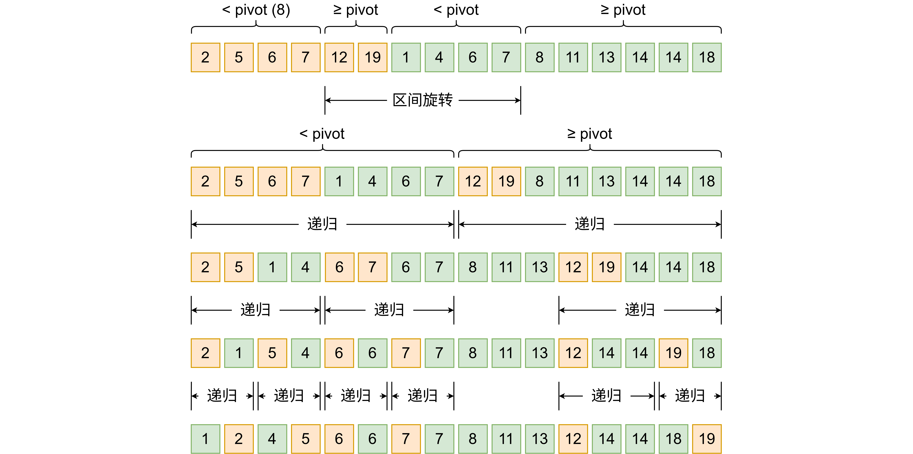

> 围绕“原地算法”的结构对称性，从 inplace merge 与 stable partition 两个经典 O(n log n) 算法切入，讨论 rotate 操作在分治中的核心作用，以及快速排序与归并排序在原地稳定算法里的镜像关系。

## 1. 从双指针 merge 开始讲起

说到合并 (merge) 两个有序数组，最简单强大的做法就是双指针。两个指针指向两个数组的开始位置，不断把较小元素放到 buffer 数组，对应指针向后移动。最后把 buffer 里的元素移动回原数组。

这个过程如下图所示：


这个算法在 C++ [std::inplace_merge](https://en.cppreference.com/w/cpp/algorithm/inplace_merge.html) 里亦有记载（如果空间够的话）。

***

但是这个算法需要一个 $O(n)$ 的额外空间复杂度（就是 buffer 数组），有没有办法可以原地进行呢？有的兄弟，原地算法有很多小巧思，这篇文章也算是个开头。

“原地”其实有两种含义，一是算法的结果直接写回原数组，比如 C++ `std::inplace_merge` 就是这个含义；二是 $O(1)$ 的额外空间复杂度，有时会允许 $O(\log n)$ 的递归栈，这篇文章的“原地”都是这个含义。

## 2. rotate 区间旋转算法

原地算法基本绕不开 rotate（区间旋转），把两个相邻区间 `[A B]` 原地变成 `[B A]`，保持区间内部顺序不变。这个方法不唯一，最经典的做法是三次翻转法（或手摇算法）：先分别翻转区间 A 和区间 B，再整体翻转整个区间 `[A B]`，就能得到 `[B A]`。

这个过程如下图所示：


这个算法在 C++ [std::rotate](https://en.cppreference.com/w/cpp/algorithm/rotate.html) 里亦有记载。当然标准库会根据数据量采用不同算法，这里就不深究了。

## 3. inplace merge 的递归算法

（我们约定 merge 的接口是，输入一个长度为 n 的数组 arr 和一个位置 pos，`arr[0] ... arr[pos - 1]` 属于第一个有序数组 A，`arr[pos] ... arr[n - 1]` 属于有序数组 B，merge 的结果是合并两个有序数组为 `arr[0] ... arr[n]`）

怎么做呢？答案是简化的快速排序。

我们选数组中的一个数 pivot = `arr[x]`（马上讲怎么选这个数）。由于两个数组一开始是有序的，每个数组天然划分成小于 pivot、大于等于 pivot 两个区间，一共 4 个区间。只要把中间两个区间旋转一下，这时候变成了左边两个有序数组，右边也是两个有序数组，递归即可。

那么怎么选择 pivot 呢？可以选择中位数，我们模拟双指针的方法可以把中位数求出来，但是这样会有找中位数的开销。所以更合理的做法是取两个有序数组里较长的那个的中间值，另一个数组就用二分查找来划分。这样最坏情况也能 1:3 的比例划分数组，整个算法时间复杂度 $O(n \log n)$，读者自证不难。因为需要调用栈，额外空间复杂度 $O(\log n)$。

***

我们来看一个例子，初始数组 `[2, 5, 6, 7, 12, 19], [1, 4, 6, 7, 8, 11, 13, 14, 14, 18]`，如何旋转和递归已经放进图里了：



***

上代码：

```cpp
#include <algorithm>
#include <print>
#include <vector>

void inplace_merge(int* l, int* m, int* r) {
    size_t len1 = m - l;
    size_t len2 = r - m;
    if (len1 == 0 || len2 == 0) {
        return;
    }
    // 较长数组取中点，另一个数组二分查找
    int* split_l = nullptr;
    int* split_r = nullptr;
    if (len1 < len2) {
        split_l = l + len1 / 2;
        split_r = std::lower_bound(m, r, *split_l);
    } else {
        split_r = m + len2 / 2;
        split_l = std::upper_bound(l, m, *split_r);
    }
    // 旋转中间两个区间
    std::rotate(split_l, m, split_r);
    // 递归
    int* new_m = split_l + (split_r - m);
    inplace_merge(l, split_l, new_m);
    inplace_merge(new_m, split_r, r);
}

int main() {
    std::vector<int> v = {2, 5, 6, 7,  12, 19, 1,  4,
                          6, 7, 8, 11, 13, 14, 14, 18};
    inplace_merge(v.data(), v.data() + 6, v.data() + v.size());
    for (int i : v) {
        std::print("{} ", i);
    }
    std::println();
}
```

***

这个算法在 C++ [std::inplace_merge](https://en.cppreference.com/w/cpp/algorithm/inplace_merge.html) 里亦有记载（如果空间不够的话）。

我们顺便浏览一下 libstdc++ 的实现。

1. [std::inplace_merge](https://github.com/gcc-mirror/gcc/blob/releases/gcc-15.2.0/libstdc%2B%2B-v3/include/bits/stl_algo.h#L2594) 会直接调用 std::__inplace_merge。
2. [std::__inplace_merge](https://github.com/gcc-mirror/gcc/blob/releases/gcc-15.2.0/libstdc%2B%2B-v3/include/bits/stl_algo.h#L2487) 如果申请 buffer 失败，调用 std::__merge_without_buffer。
3. [std::__merge_without_buffer](https://github.com/gcc-mirror/gcc/blob/releases/gcc-15.2.0/libstdc%2B%2B-v3/include/bits/stl_algo.h#L2437) 这里就是上面算法的实现了。

## 4. stable partition 的递归算法

划分 (partition) 是快速排序里的一个步骤，就是给定一个谓词（即返回 bool 的函数），把数组里满足谓词的数字放前面，不满足的放后面。这里再加个稳定的要求，就是保持满足谓词的数字之间顺序不变，不满足的同理。

怎么做呢？答案是简化的归并排序。

我们取中间位置，左右两边分别递归求解，这样左右分别得到满足谓词、不满足谓词两个区间，一共 4 个区间。这时候只要把中间两个区间旋转一下，就结束了。旋转 $O(n)$ 就行了，整个算法时间复杂度 $O(n \log n)$，读者自证不难。

这个算法在 C++ [std::stable_partition](https://en.cppreference.com/w/cpp/algorithm/stable_partition.html) 里亦有记载（如果空间不够的话）。

***

上代码：

```cpp
#include <algorithm>
#include <print>
#include <vector>

template <typename Pred>
int* stable_partition(int* l, int* r, Pred pred) {
    size_t len = r - l;
    if (len == 0) {
        return l;
    } else if (len == 1) {
        return l + pred(*l);
    }
    int* m = l + len / 2;
    // 递归
    int* split_l = stable_partition(l, m, pred);
    int* split_r = stable_partition(m, r, pred);
    // 旋转中间两个区间
    std::rotate(split_l, m, split_r);
    return split_l + (split_r - m);
}

int main() {
    std::vector<int> v = {8, 19, 2,  13, 6,  4,  5,  7,
                          7, 18, 14, 6,  14, 12, 11, 1};
    stable_partition(v.data(), v.data() + v.size(),
                     [](int x) { return x < 7; });
    for (int i : v) {
        std::print("{} ", i);
    }
    std::println();
}
```

## 5. inplace merge 的迭代算法

inplace merge 的递归算法并不是严格的原地算法，不满足额外空间复杂度 $O(1)$。那么怎么修改呢？

上面算法的 $O(\log n)$ 空间是调用栈造成的。调用栈的作用，是为了恢复调用方的状态，那么什么情况下不用栈也能恢复状态呢？对于区间范围，我们需要把数组划分到确定的位置，最简单的就是 2 的整数幂位置，这样通过二进制运算就能恢复了。对于初始两个有序数组的分界线，这个可以直接遍历一遍找到。

更进一步，还可以把 DFS 简化为 BFS 写法，自顶向下进行。具体算法就是，先确定大于等于数组大小的 2 的整数幂（C++ 的 `std::bit_ceil`）为 block。把整个数组按大小为 block 分块，每个 block 块划分为 `block / 2` 和剩下部分，然后 `block /= 2` 重复分块的步骤，直到 block 变成 1。

伪代码如下：

```cpp
void inplace_merge(int* l, int* m, int* r) {
    size_t len = r - l;
    for (size_t block = std::bit_ceil(len); block > 1; block /= 2) {
        for (size_t start = 0; start + block / 2 < len; start += block) {
            /* 划分为 [i, i + block / 2 - 1] [i + block / 2, i + std::min(block, len) - 1] */
        }
    }
}
```

于是问题就剩下如何划分了。由于一开始数组是两个有序数组组成，遍历一遍可以找到两个有序数组的分界线。通过双指针找第 `block / 2` 小的数，确定了这些就是一个 rotate 完成划分了。

那么为什么每次都能保证一开始是两个有序数组组成？因为每层做的事情，是把区间里的两个有序数组划分成 4 个有序数组，而前两个数组“拼接”后正好落在下一层处理的区间内，后两个也是。这就完成了归纳。

这个算法虽然节省了递归栈的空间，但是性能会大打折扣，只能作为理论上的探索。

***

上代码：

```cpp
#include <algorithm>
#include <print>
#include <vector>

void inplace_merge(int* l, [[maybe_unused]] int* m, int* r) {
    size_t len = r - l;
    for (size_t block = std::bit_ceil(len); block > 1; block /= 2) {
        for (size_t start = 0; start + block / 2 < len; start += block) {
            int* block_l = l + start;
            int* block_r =
                block_l + std::min(block, static_cast<size_t>(r - block_l));
            // 找到两个有序数组分界线
            int* block_m = block_l + 1;
            while (block_m < block_r && *(block_m - 1) < *block_m) {
                block_m++;
            }
            // 找到第 block / 2 小的两个分界线
            int* split_l = block_l;
            int* split_r = block_m;
            for (size_t i = 0; i < block / 2; ++i) {
                if (split_r == block_r ||
                    (split_l < block_m && *split_l <= *split_r)) {
                    split_l++;
                } else {
                    split_r++;
                }
            }
            // 旋转中间两个区间
            std::rotate(split_l, block_m, split_r);
        }
    }
}

int main() {
    std::vector<int> v = {2, 5, 6, 7,  12, 19, 1,  4,
                          6, 7, 8, 11, 13, 14, 14, 18};
    inplace_merge(v.data(), v.data() + v.size());
    for (int i : v) {
        std::print("{} ", i);
    }
    std::println();
}
```

## 6. stable partition 的迭代算法

stable partition 的迭代算法也是非常接近 inplace merge 倒着执行。用 2 的整数幂来作为 block 大小，自底向上进行。同样，区间范围已经用数学方法确定了，而两个分割点通过遍历找到。

上代码：

```cpp
#include <algorithm>
#include <print>
#include <vector>

template <typename Pred>
int* stable_partition(int* l, int* r, Pred pred) {
    size_t len = r - l;
    for (size_t block = 2; block <= std::bit_ceil(len); block *= 2) {
        for (size_t start = 0; start + block / 2 < len; start += block) {
            int* block_l = l + start;
            int* block_r =
                block_l + std::min(block, static_cast<size_t>(r - block_l));
            int* block_m = block_l + block / 2;
            // 遍历找到左右区间分割点
            int* split_l = std::find_if_not(block_l, block_m, pred);
            int* split_r = std::find_if_not(block_m, block_r, pred);
            // 旋转中间两个区间
            std::rotate(split_l, block_m, split_r);
        }
    }
    return std::find_if_not(l, r, pred);
}

int main() {
    std::vector<int> v = {8, 19, 2,  13, 6,  4,  5,  7,
                          7, 18, 14, 6,  14, 12, 11, 1};
    stable_partition(v.data(), v.data() + v.size(),
                     [](int x) { return x < 7; });
    for (int i : v) {
        std::print("{} ", i);
    }
    std::println();
}
```

## 7. 原地算法的对称性：从 merge 到 partition

终于写到真正的主题了。

有没有发现，不管是递归版还是迭代版，我讲 stable partition 算法时好像在倒着讲述 inplace merge 算法。

merge 和 partition 仿佛就是关于时间对称的两个算法，inplace merge 是自顶向下，stable partition 是自底向上。

它们你中有我，我中有你：inplace merge 是简化的快速排序，单个步骤是 partition，通过 rotate 将 2 个区间划分为 4 个区间；stable partition 是简化的归并排序，单个步骤是 merge，通过 rotate 将 4 个区间合并为 2 个区间。

算法之美往往藏在细节里，三言两语难以描绘，但我仍然想把这心情传达给每一个读者。

***

我问 DeepSeek 为什么文章发布了没人看，DeepSeek 说建议“标题党”一点：

《面试官问我 inplace_merge 怎么实现，我给他讲了一个对称性》

《如果你理解了 rotate，就理解了原地算法的一半》

《C++ 标准库源码里藏着的两个对称算法》

有内味了。

***

想必有人不满意 $O(n\log n)$ 的时间复杂度吧。其实存在 $O(n)$ 的原地稳定 merge 算法，这个算法也能很容易实现 $O(n \log n)$ 原地稳定排序，这边就挖个坑。
