一个冷门、复杂又不实用的数据结构，缺点全占了，所以就图一乐。

替罪羊表是支持查询和插入的有序容器，查询复杂度 $O(\log n)$，插入均摊复杂度 $O(\log^2 n)$，有类似替罪羊树的重建机制。但是不支持删除。

参考的论文是 [A Sparse Table Implementation of Priority Queues](https://doi.org/10.1007/3-540-10843-2_34)。

没错，原论文叫它稀疏表 (Sparse Table)，这名字和关于区间最值 (RMQ) 的著名数据结构重名了。所以我给前者起了个名字叫“替罪羊表” (Scapegoat Table)。

有趣的是这几个论文发表时间，替罪羊表 1981，稀疏表 1984，替罪羊树 1993，替罪羊表是最早的。

## 1. 不是很简的简介

替罪羊表维护了一个有序数组，包含了真实键 (genuine keys) 和虚拟键 (dummy keys)。真实键出现在连续几个相同键的最后一个，其他都是虚拟键。例如，`[2, 3, 3, 3, 5, 5]` 里的 2、最后一个 3、最后一个 5 是真实键，其他是虚拟键。

查询只要当成有序数组来二分查找即可，支持 `contains`、`lower_bound` 这些和 `std::map` 相同的查询操作。

插入分为两步，第一步是 `lower_bound` 找到它应该插入的位置，然后向右找虚拟键（如果找不到就向左），将这些真实键右移腾出位置来，然后插入。

***

插入的第二步是重平衡，这是算法最核心的部分。分块维护每块真实键的个数，然后在这些块上建线段树（只需要单点修改、查询线段树节点对应区间的和）。

给线段树叶节点赋予密度阈值 `tau_leaf`，根节点赋予 `tau_root`，`tau_leaf > tau_root`。中间节点的密度阈值是关于高度的一次函数。

如果插入导致了叶节点的密度（真实键除以区间大小）超过密度阈值，找最近的不超密度阈值的祖先，重分布这个区间，即让真实键尽可能均匀分布。如果没有不超密度阈值的祖先，就按一定倍数扩容。



## 2. 复杂度

原论文有一些约束，m 是有序数组的大小，h 是线段树高度（根和叶子之间的距离），b 是块大小。

数组大小 m 和插入次数的关系是 $m=O(n)$，因为扩容是按倍数扩容。

$$m=b\cdot 2^h$$

上面的式子比较显然，数组大小等于块大小乘以块数。

$$b=\Theta(\log m)$$

上面的式子是为了每次插入的移动元素次数不超过 $O(\log m)$。其实可以是别的渐进复杂度，比如 $\Theta(\log^2 m)$（这样插入复杂度不会变化），选择 $\Theta(\log m)$ 只是在移动次数和重分布次数之间选了一个均衡的值。

***

可以推导出 $h=\Theta(\log m)$，因为 $h=\log\frac{m}{b}=\log m-\log b$，显然 $\log m$ 是主导渐进复杂度的项。

***

那么怎么证明重分布的均摊复杂度 $O(\log ^2 n)$ 呢，我们看线段树某一个节点的重分布触发次数。

第 q 层的节点密度阈值 $\tau_q$，子节点的密度阈值 $\tau_{q+1}$。节点重分布后，两个子节点密度不超过 $\tau_q$，要插入次数为密度差 $\tau_{q+1}-\tau_q=(\tau_{\mathrm{leaf}}-\tau_{\mathrm{root}})/h$ 乘以区间大小 $b\cdot 2^{h-q-1}$ 才会触发重分布。一次重分布复杂度是 $O(b\cdot 2^{h-q})$。

$$\frac{O(b\cdot 2^{h-q})}{(\tau_{\mathrm{leaf}}-\tau_{\mathrm{root}})/h\cdot b\cdot 2^{h-q-1}} = O(h) = O(\log m)$$

这是单层的复杂度，$h$ 层数就是 $O(\log^2 m)$ 了。

## 3. 实现替罪羊表

这里讲一下实现细节。

### 3.1. 块大小和高度

数组大小、分块大小、线段树高度，如果没处理好就会有不整除的问题。

之前我们讲到 $m=b\cdot 2^h$ 和 $b=\Theta(\log m)$，把后者写成 $m=\Theta(2^b)$ 代入前者得到 $\Theta(2^b)=b\cdot 2^h$，把 $\Theta$ 去掉整理一下就是：

$$h=b-\lfloor\log b\rfloor$$

我们让 b 从 1 开始往上不断加一，就能算出 h 和 m，如果 m 大于等于期望的大小就停止。m 同时是 b 和 $2^h$ 的倍数，不用担心整除的问题。

```cpp
// returns {b·2^h, b, 2^h, h} where h = max(0, b - bit_width(b) + 1)
static std::tuple<int64_t, int64_t, int64_t, int64_t> dimensions(int64_t size) {
    int64_t block_size = 1;
    int64_t capacity = 2;
    while (capacity < size) {
        block_size++;
        capacity =
            block_size << (block_size -
                            static_cast<int64_t>(std::bit_width(uint64_t(block_size))) + 1);
    }
    int64_t n_blocks = capacity / block_size;
    int64_t height = std::bit_width(uint64_t(n_blocks)) - 1;
    return {capacity, block_size, n_blocks, height};
}
```

### 3.2. tau 值

$\tau$ 关于层数是一个一次函数。

```cpp
double tau(int64_t level) const {
    return tau_root + ((tau_leaf - tau_root) * static_cast<double>(level) / height_);
}
```

### 3.3. 重平衡

某个位置从虚拟键变成真实键后，需要做以下事情：

- `increment_counts` 线段树从叶子到根的计数器加一。
- `find_scapegoat` 找到最近平衡祖先，如果找到的话：
  - `genuine_keys` 把这个区间的真实键复制到一个临时 `std::vector`。
  - `redistribute` 把 `std::vector` 均匀平铺到区间内，同时设置虚拟键。
  - `update_counts` 更新区间里的计数器。
- 如果没找到，就要扩容：
  - `genuine_keys` 把所有的真实键复制到一个临时 `std::vector`。
  - 更新一些参数，数组扩容。
  - `redistribute` 把 `std::vector` 均匀平铺到数组内，同时设置虚拟键。
  - `update_counts` 更新所有计数器。

```cpp
void resize(int64_t size) {
    assert_or_throw(size <= max_capacity);
    auto keys = genuine_keys(0, n_blocks_);
    std::tie(capacity_, block_size_, n_blocks_, height_) = dimensions(size);
    data_.resize(capacity_, T{});
    counts_.assign(n_blocks_ * 2, 0);
    redistribute(0, n_blocks_, keys);
    update_counts(0, n_blocks_);
}

void rebalance(int64_t block_idx) {
    increment_counts(block_idx);
    int64_t flatten_level = find_scapegoat(block_idx);
    if (flatten_level >= 0 && flatten_level < height_) {
        int64_t len = (1 << (height_ - flatten_level));
        int64_t start = block_idx / len * len;
        int64_t end = start + len;
        auto keys = genuine_keys(start, end);
        redistribute(start, end, keys);
        update_counts(start, end);
    } else if (flatten_level == -1) {
        resize(capacity_ * 2);
    }
}
```

## 4. 删除操作

我在前面直接说不支持删除，为什么这么说呢？

第一层，删除时把真实键和虚拟键都替换为后继元素。这个问题是，一个均匀的替罪羊表，从小到大删除就可以卡 $O(n^2)$ 了。

第二层，删除需要在数组里维护删除标记，这是论文的做法。这个问题是，`lower_bound` 会找不到真实键，继续往后找就变 $O(n)$ 了。

第三层，`lower_bound` 也改为均摊做法，将一系列假的键替换为后继值。这个问题是，一个均匀的替罪羊表，不断删除最小值和 `lower_bound` 查询刚刚删除的最小值，就可以卡 $O(n^2)$ 了。

第四层，没错，该并查集登场了，通过堆很多指针来避免复杂度退化。

只能说，理论可行，只不过移动键、线段树计数器、重分布，都要对此进行调整。为了删除把整个数据结构都换了一个，这能叫替罪羊表吗，不如叫忒修斯之船吧。所以还是放弃思考，不支持删除了。

## 5. 放个代码

[完整代码](https://github.com/axiomofchoice-hjt/TCS-Algorithms/blob/master/include/tcs/ds/scapegoat_table.hpp)和[测试](https://github.com/axiomofchoice-hjt/TCS-Algorithms/blob/master/tests/ds/test_scapegoat_table.cpp)。

## 6. 结尾

我的实现完全不考虑常数，仍然写了 180 行，快赶上红黑树了。如果不是随机插入（比如顺序插入），性能会显著被 $O(\log^2 n)$ 的复杂度影响，相比平衡树只能说拉完了。

当然常数我也懒得优化，这篇文章就单纯看起来好玩。同时一个原地排序算法依赖这个结构，非常学术，可以期待一下。
