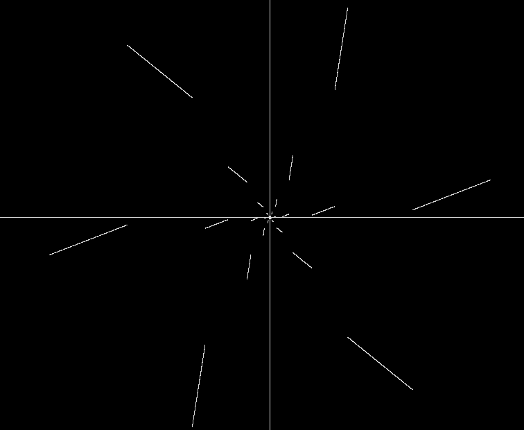

从某道高考模拟题改编过来，算是原创的吧．看起来有点自招题的风格．如有错误，轻喷．

标题的表述为了精简，所以问题的较为严谨的表述是，是否存在定义在 $R$ 上的函数 $f(x)$ 满足其图像绕原点逆时针旋转 $\dfrac{\pi}{3}$ 后与原图像重合？

证明该函数的存在性如下：

易得 $f(0)=0$．

对于 6 个点的集合 $V=\{A,B,C,D,E,F\}$，要求任意 $P\in V$ 都有 $P$ 绕原点旋转 $\dfrac{\pi}{3}$ 后的点 $\in V$．

（记点 A 的横坐标为 $x_A$，纵坐标为 $y_A$，以此类推）

不妨设 $x_A,x_B,x_C>0$，且 $x_C$ 最大．

由正三角形的性质，易得 $x_C=x_A+x_B$．

并且对于为任意不相等的正数 $m,n$，都可以使 $x_A=m,x_B=n,x_C=m+n$．

（如果无法理解，那么可以暴力计算得到如下结论，再强行带成 $m,n$ 即可）

若已知 $x_B,x_C$,则 $y_B=\dfrac{x_B-2x_C}{\sqrt 3}, y_C=\dfrac{2x_B-x_C}{\sqrt 3}$，或者 $y_B,y_C$ 同时取它们的相反数．

由于 $x_A$ 和 $x_B$ 的值比较任意，那么可以构造这样的参数方程：

当 $x_A,x_B,x_C\in (1,5]$，参数 $t\in (0,1]$ 时：

$$x_A=t+1$$

$$x_B=t+2$$

$$x_C=2t+3$$

而 $x_A,x_B,x_C \in (\dfrac{1}{5}, 1], (5,25]$ 等区间也可以进行类似操作．

（注意这个图和证明里的函数图像不一样，改了个参数）

得证．
