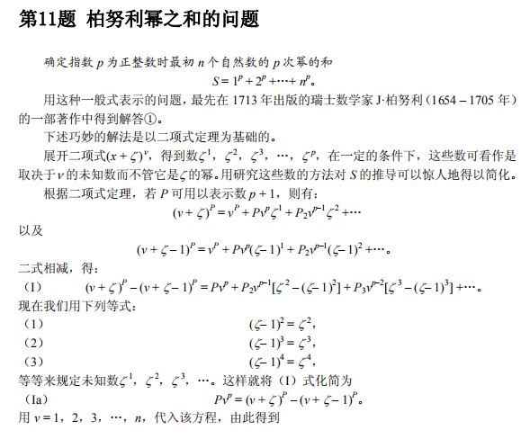
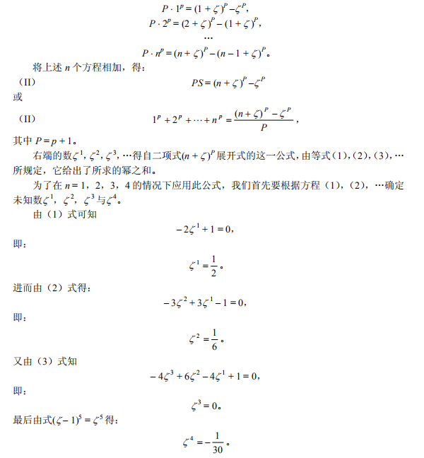
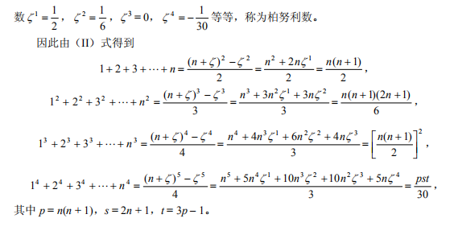

以下内容整理自《100个著名初等数学问题历史和解》

算术部分

## 1. 均值不等式（柯西的平均值定理）

求证：$\dfrac{a_1+a_2+...+a_n}{n} \ge \sqrt[n]{a_1a_2...a_n}$ $(a_i>0)$

引理1：若 $p\ge 0,n\in N_+$，则 $(p+1)^n\ge np+1$．

证明：二项式定理可得：

$$(p+1)^n=1+np+(C^2_np^2+...+np^{n-1}+p^n)\ge 1+np$$

引理2：若 $a\ge b,n\in N_+$，则 $\dfrac{a+(n-1)b}{n}\ge \sqrt[n]{ab^{n-1}}$．

证明：将 $p=\sqrt[n]{\dfrac a b}-1$ 代入引理1（$(p+1)^n\ge np+1$）得：

$$\dfrac ab=n\sqrt[n]{\dfrac a b}-n+1 \Leftrightarrow \dfrac{\dfrac a b +n-1}n=\sqrt[n]{\dfrac a b}$$

两边乘 $b$ 即可．

回到原定理，现用数学归纳法证明余下部分．

当 $n=1$ 时显然成立．

当 $n=k$ 时，$\dfrac{a_1+a_2+...+a_k}k \ge \sqrt[k]{a_1a_2...a_k}$ 成立，则 $n=k+1$ 时，不妨设 $a_{k+1}$ 为最大项，令 $x=\sqrt[k]{a_1a_2...a_k}$ 有：

$$\dfrac{(a_1+a_2+...+a_k)+a_{k+1}}{k+1}\ge \dfrac {k\sqrt[k]{a_1a_2...a_k}+a_{k+1}}{k+1}=\dfrac {kx+a_{k+1}}{k+1}$$

而 $a_{k+1}\ge x$，因此有引理2 可得 $\dfrac {kx+a_{k+1}}{k+1}\ge \sqrt[k+1]{x^ka_{k+1}}= \sqrt[k+1]{a_1a_2...a_{k+1}}$．

因此对于 $n\in N_+$ 时命题成立．

## 2. 伯努利幂之和问题

求：$1^k+2^k+...+n^k$

解：

$$1^k+2^k+...+n^k =\dfrac 1 {k+1}(n^{k+1}+B_1C^1_kn^k+B_2C^2_kn^{k-1}+...+B_kC^k_kn^1)$$

其中 $B_i$ 为伯努利数，可代入 $n=1,k=1,2,...$ 计算可得．

（编者：至于为什么，抱歉凭借我的能力还无法理解这神仙操作。。直接截图吧）

## 3. 欧拉数（自然常数）

求证 $\lim_{x \to +\infty}(1+\dfrac 1x)^x$ 收敛

引理：由均值不等式，$\dfrac{x+x+...+x+1+1+...+1}n \ge \sqrt[n]{x^m}$

$\dfrac{mx+n-m}n\ge\sqrt[n]{x^m}$

令 $q=\dfrac m n$ 得 $x^q\le q(x-1)+1$ ①

***

（编者：如果求导来证明单调性不太好，因为求导是用自然常数的定义证明的）

从函数 $f(x)=(1+\dfrac 1x)^x,g(x)=(1+\dfrac 1x)^{x+1},x\in N_+$ 开始

易得 $f(x)<g(x)$

***

代 $x=1+\dfrac 1b,q=\dfrac b a$ 入 ① 得（$x\ne 1$ 不取等号）

$$(1+\dfrac 1 b)^b<(1+\dfrac 1 a)^a$$

即 $f(x)$ 单增

***

代 $x=1-\frac1{b+1},q=\dfrac {b+1} {a+1}$ 入 ① 得（$x\ne 1$ 不取等号）

$$(1+\dfrac 1 b)^{b+1}>(1+\dfrac 1 a)^{a+1}$$

即 $g(x)$ 单减

***

$g(1)=4$ 因此 $f(x)<4$

且 $g(x)-f(x)=\dfrac 1x(1+\dfrac 1x)^x=\dfrac 1xf(x)$

因此 $\lim_{x \to +\infty}[g(x)-f(x)]=0$，$\lim_{x\to +\infty}f(x)$ 和 $\lim_{x\to +\infty}g(x)$ 收敛于一个定值

## 4. 错排问题（伯努利 - 欧拉关于装错信封的问题）

某人写了几封信，并且在几个信封上写下了对应的地址，把所有信笺装错信封的情况下，共有多少种可能？

解：这题可以用容斥原理，或者书里的方法如下

记信笺为 $a,b,c,...$，其对应的信封为 $A,B,C,...$，错误装法数为 $a_n$

第一种情况：

$a$ 装进了 $B$（$a$ 装进 $C$ 同理，因此下式乘了 $(n-1)$），$b$ 装进了 $A$，剩下的错排

这种情况数为 $(n-1)a_{n-2}$

第二种情况：

$a$ 装进了 $B$（$a$ 装进 $C$ 同理，因此下式乘了 $(n-1)$），$b$ 装进了 $C$

我们把 $b$ 和 $B$ 扔掉，把 $a$ 装进 $C$ 里，这个操作前和操作后的情况数是相同的

这种情况数为 $(n-1)a_{n-1}$

于是有了递推式

$$a_n=(n-1)(a_{n-1}+a_{n-2})$$

$$a_n-na_{n-1}=-(a_{n-1}-(n-1)a_{n-2})$$

接下来就是等比数列 blabla

总之答案是

$$a_n=A_n^n-A_n^{n-1}+...+(-1)^nA_n^0$$

$$=n!(\dfrac 1 {2!}-\dfrac 1 {3!}+...+\dfrac{(-1)^n}{n!})$$

## 5. 卡特兰数

成对地计算 $n$ 个不同因子的乘积，共有多少种方法？

例如，当 $n=4$ 时，

$$a\cdot  b\cdot  c\cdot  d=((a\cdot  b)\cdot  c)\cdot  d=(a\cdot  (b\cdot  c))\cdot  d$$

$$=(a\cdot  b)\cdot  (c\cdot  d)=a\cdot  ((b\cdot  c)\cdot  d)=a\cdot  (b\cdot  (c\cdot  d))$$

有 5 种

解：

如果将 $n$ 个因子写成 $k$ 个因子和 $(n-k)$ 个因子的乘积，递推式就出来了

$$a_n=a_1a_{n-1}+a_2a_{n-2}+...+a_{n-1}a_1\space (a_1=1)$$

当然卡塔兰数满足的递推式有点不一样

$$C_n=C_0C_{n-1}+C_1C_{n-2}+...+C_{n-1}C_0\space (C_0=1)$$

而卡塔兰数的通项公式为 $C_n=\dfrac {C_{2n}^n} {n+1}$

这可以用数学归纳法证明，这道题就这么被解决了

（我怎么能这么懒呢，还是提供一个正常方法吧）

书里的方法没怎么看懂，我打算加强一下命题，转到

## 6. 黑白块问题

$(n+m)$ 个方块排成一排，其中有 $m$ 个黑块，$n$ 个白块 $(m\ge n)$，要求前 $k(k=1,2,...,n+m)$ 块中，黑块个数不少于白块个数，问可能的情况数

解：

如果随便乱涂，总数为 $C_{m+n}^m$

在随便乱涂的情况中考虑不符合要求的情况，必然有最小的正整数k，前 $(2k+1)$ 块中有 $k$ 个黑块，$(k+1)$ 个白块

将后 $(n+m-2k-1)$ 块反色，即黑变白，白变黑，得到的方块排列可以看作是 $(n-1)$ 个黑块，$(m+1)$ 个白块的随便乱涂的方块排列

而后者也可以通过反色来得到前者

即，不符合要求的情况和 $(n-1)$ 个黑块，$(m+1)$ 个白块的随便乱涂的情况一一对应

因此不符合要求的总数为 $C_{m+n}^{m+1}$

综上，黑白块问题的答案是 $C_{m+n}^m-C_{m+n}^{m+1}$

当 $n=m$ 时，答案就变成了卡特兰数 $\dfrac {C_{2n}^n} {n+1}$，至于为什么这个问题可以解决前面问题，请读者自己思考
