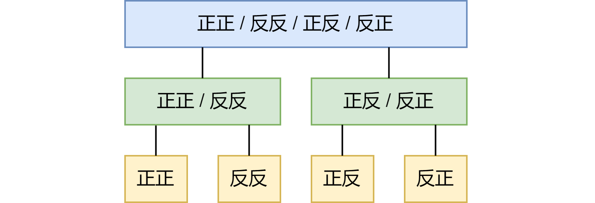
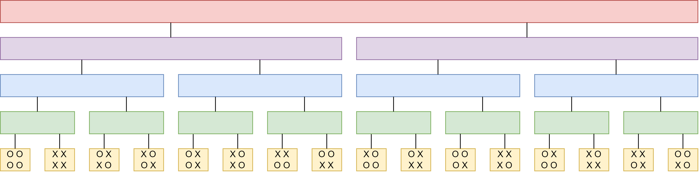

这是很久以前群里讨论过的问题。

棋盘四个角各有一个硬币。你看不到棋盘和硬币，每一回合可以选择翻某些位置上的硬币。在你翻完后，另一个人会旋转棋盘（旋转角度为 0/90/180/270 度这四个中的一个），但是你不知道棋盘旋转了几度。两个人交替进行操作 15 回合。（为了防止有人用无限次操作卡 bug，这个游戏只进行 15 回合）

问你是否有策略必然可以让某一时刻所有硬币正面朝上。

***

答案是肯定的。

我们先简化一下问题。假设只有两个硬币，策略是：

第一回合翻两个硬币，第二回合翻一个硬币，在第三回合翻两个硬币。

***

在两个硬币的问题中，我们假设 4 个情况（正正、正反、反正、反反）各自为一个集合。

如果我们把**翻两个硬币**可以互相转换的情况合并为一个集合，于是一正一反的两个情况是一个集合，两个正和两个反是一个集合。每个集合的内部可以通过**翻两个硬币**来转换。这是第 1 层。

进一步，我们允许**翻两个硬币**和**翻一个硬币**，两个集合就会合并。这是第 2 层。

没错，这是一棵二叉树：

策略是，我们先在第 1 层进行操作（即翻两个硬币）（在二叉树上是跳到黄色的兄弟节点），然后在第 2 层进行操作（即翻一个硬币）（在二叉树上是找到绿色的父节点，然后跳到绿色的兄弟节点的**某个**叶子上），最后又在第 1 层进行操作。整个过程，实际上就是在遍历二叉树。

***

这个思路处理四个硬币就可以很快解决。我们认为：

- 翻四个硬币是第 1 层。
- 翻对角的两个硬币是第 2 层。
- 翻相邻的两个硬币是第 3 层。
- 翻 1 个硬币是第 4 层。

画个图就是：

- 在第 1 层操作，在二叉树上是跳到黄色的兄弟节点。
- 在第 2 层操作，在二叉树上是找到绿色的父节点，跳到绿色的兄弟节点的**某个**叶子上。
- 在第 3 层操作，在二叉树上是找到蓝色的祖父节点，跳到蓝色的兄弟节点的**某个**叶子上。
- 在第 4 层操作，在二叉树上是找到紫色的曾祖父节点，跳到紫色的兄弟节点的**某个**叶子上。

如果答案用层数来表示，那就是 1 2 1 3 1 2 1 4 1 2 1 3 1 2 1（第 i 个数等于 i 的质因数 2 的个数 + 1），用文字表达就是翻全部、翻对角、翻全部、翻相邻、翻全部、翻对角、翻全部、翻一个、翻全部、翻对角、翻全部、翻相邻、翻全部、翻对角、翻全部。

***

课后习题：如果有 8 个硬币？如果有 3 个硬币？（逃
