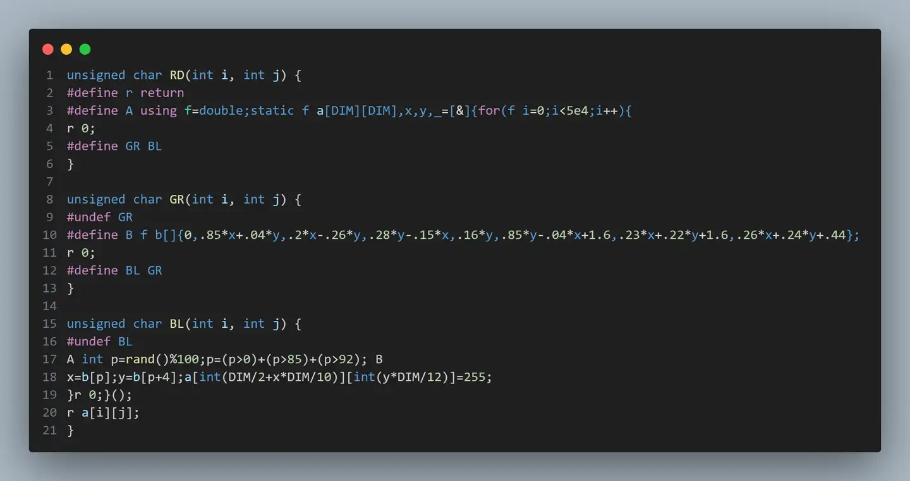

今天看到个 Tweetable Mathematical Art 比赛：[有没有一段代码，让你为人类的智慧击节叫好？](https://www.zhihu.com/question/30262900/answer/48741026)

> 参赛者需要用 C++ 语言编写 RD 、 GR 、 BL 三个函数，每个函数都不能超过 140 个字符。每个函数都会接到 i 和 j 两个整型参数（0 ≤ i, j ≤ 1023），然后需要返回一个 0 到 255 之间的整数，表示位于 (i, j) 的像素点的颜色值。

我看了一圈竟然没有巴恩斯利蕨，尝试写了一段：

```cpp
unsigned char RD(int i, int j) { return 0; }

unsigned char GR(int i, int j) {
    static int a[DIM][DIM]{};
    static int _ = [&] {
        double x = 0, y = 0;
        for (int i = 0; i < 50000; i++) {
            int p = rand() % 100;
            p = (p > 0) + (p > 85) + (p > 92);
            double x1[]{0, 0.85 * x + 0.04 * y, 0.2 * x - 0.26 * y,
                        -0.15 * x + 0.28 * y};
            double y1[]{0.16 * y, -0.04 * x + 0.85 * y + 1.6,
                        0.23 * x + 0.22 * y + 1.6, 0.26 * x + 0.24 * y + 0.44};
            x = x1[p];
            y = y1[p];
            int ix = int(DIM / 2 + x * DIM / 10), iy = int(y * DIM / 12);
            a[ix][iy] = 255;
        }
        return 0;
    }();
    return a[i][j];
}

unsigned char BL(int i, int j) { return 0; }
```

经过各种奇怪的压行后，代码变成了这样：

```cpp
unsigned char RD(int i, int j) {
#define r return
#define A using f=double;static f a[DIM][DIM],x,y,_=[&]{for(f i=0;i<5e4;i++){
r 0;
#define GR BL
}

unsigned char GR(int i, int j) {
#undef GR
#define B f b[]{0,.85*x+.04*y,.2*x-.26*y,.28*y-.15*x,.16*y,.85*y-.04*x+1.6,.23*x+.22*y+1.6,.26*x+.24*y+.44};
r 0;
#define BL GR
}

unsigned char BL(int i, int j) {
#undef BL
A int p=rand()%100;p=(p>0)+(p>85)+(p>92); B
x=b[p];y=b[p+4];a[int(DIM/2+x*DIM/10)][int(y*DIM/12)]=255;
}r 0;}();
r a[i][j];
}
```



三个函数分别是 113, 137, 133 字符，勉强完成任务。
