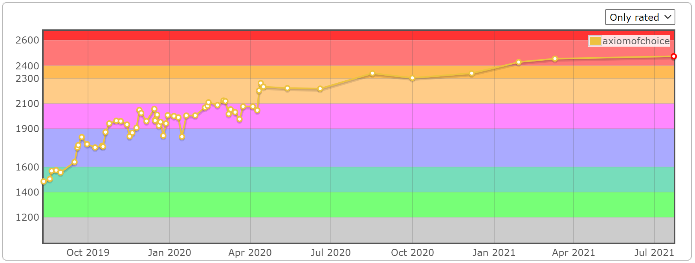
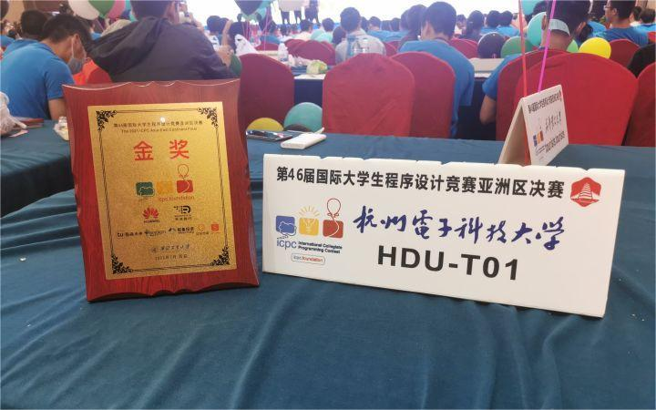

## 1. 简介

选择公理，HDU 本科，入职华为做 HPC / AI 相关工作。

爱好是学习和分享知识，LOL 大乱斗，写游戏。

理想是 965，写 C++，和聪明的人合作。

## 2. 项目经历

Kunpeng Alphafold 推理框架的原型（工作）

<!-- <https://gitee.com/kunpeng-hpc/kunpeng-extension-for-pytorch> <https://gitee.com/kunpeng-hpc/kutacc> -->

Kunpeng DeepSeek-R1 分布式推理框架的原型（工作）

<!-- 负责推理引擎的大部分框架开发。

<https://gitee.com/kunpeng-hpc/KunpengDistInfer> <https://gitee.com/kunpeng-hpc/kutacc/tree/dist_infer> -->

## 3. 分享知识

一个技术爱好者。

[ACM 竞赛板子](https://github.com/axiomofchoice-hjt/ACM-axiomofchoice/)

[败犬日报 | C++ 话题每日推送](https://makeinu-daily.pages.dev/)

以及 C++、性能优化、算法为主的文章，代表作：

[浮点数误差入门](/pages/c1e151/)

[集合求并的极致优化](/pages/85c4ed/)

## 4. ACM 生涯

|      时间      |                 事件                 |
| :------------: | :----------------------------------: |
| 2019 /  7 / 11 |     注册了 HDOJ（决定要打 ACM）      |
| 2019 /  8 / 11 |        打了第一把 Codeforces         |
| 2019 /  9 / 15 |           Codeforces 上蓝            |
| 2019 /  9 / 19 |         正式加入 HDU 集训队          |
| 2019 / 10 / 24 |           Codeforces 上紫            |
| 2020 /  2 / 13 |           Codeforces 上黄            |
| 2020 /  3 /  1 |      在 Cnblogs 里发布 ACM 模板      |
| 2020 /  6 / 21 |   吾有一數名之曰誒 (int a) 队诞生    |
| 2020 / 10 / 18 |       CCPC 秦皇岛拿金，rank 17       |
| 2020 / 11 /  8 |        CCPC 长春拿金，rank 18        |
| 2020 / 11 / 22 |     ICPC 小米邀请赛打铁，rank 83     |
| 2020 / 12 / 20 | ICPC 南京拿金，rank 6；在此站出线 WF |
| 2021 /  1 / 28 |           Codeforces 上红            |
| 2021 /  4 / 18 |     ICPC EC Final 拿银，rank 37      |
| 2021 /  5 / 16 |        ICPC 银川拿金，rank 24        |
| 2021 /  5 / 30 |       CCPC Final 拿铜，rank 43       |
| 2021 /  7 / 14 |   吾有一數名之曰嗶 (int b) 队诞生    |
| 2021 / 11 / 14 |        CCPC 广州拿金，rank 6         |
| 2021 / 11 / 21 |        ICPC 沈阳拿金，rank 24        |
| 2021 / 11 / 28 |       CCPC 哈尔滨拿金，rank 13       |
| 2021 / 12 /  4 |        ICPC 南京拿银，rank 77        |
| 2022 /  7 / 20 |     ICPC EC Final 拿金，rank 13?     |
| 2023 /  4 / 15 |     最后一场比赛（浙江省赛）结束     |

