## 1. 简介

<el-button type="primary" @click='click'>游戏链接</el-button>

一个解密游戏，规则由玩家发掘，难度较高。

## 2. 攻略 1-10

### 2.1. 第 1 关

> 规则

- 在 5 次机会里猜出正确数字。
- 会提示正确数字与猜的数字的大小关系。

> 攻略

每次点击答案的范围内最中间的数字，并缩小答案的范围。

比如一开始答案范围是 $[1,31]$，第一次点击 $\tfrac{1+31}{2}=16$。如果这个方块是蓝色，答案范围缩小为 $[1,15]$，第二次点击 $\tfrac{1+15}{2}=8$；如果这个方块是黄色，答案范围缩小为 $[17,31]$，第二次点击 $\tfrac{17+31}{2}=24$。

> 原理

二分查找算法。

作为新手引导关卡当然要选择广为人知的算法了。

### 2.2. 第 2 关

> 规则

- 用 3 次操作把所有灰色方块染成其他颜色。
- 点击灰色方块，该方块所在的行和列的所有方块都会变成蓝色。
- 点击蓝色方块，该方块为中心的 $3\times 3$ 范围内的方块都会变成黄色。

> 攻略

按数字顺序点击：

### 2.3. 第 3 关

> 规则

- 放置 3 + 3 + 5 个形状。
- 不能重叠放置。

> 攻略

点击所有 1，然后点击所有 2，最后点击所有 3：

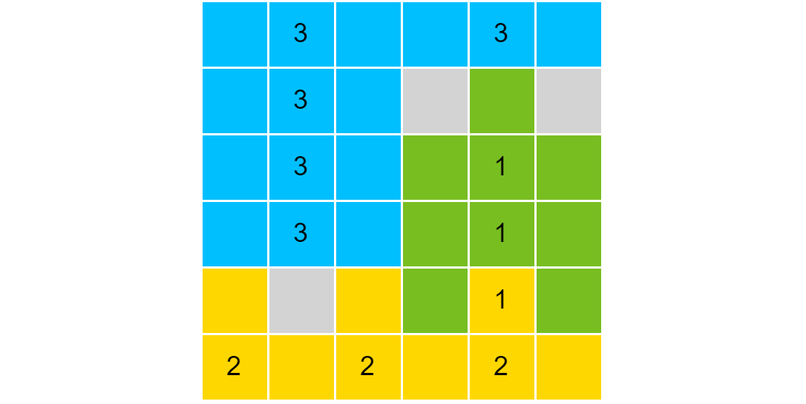

另一种解法：

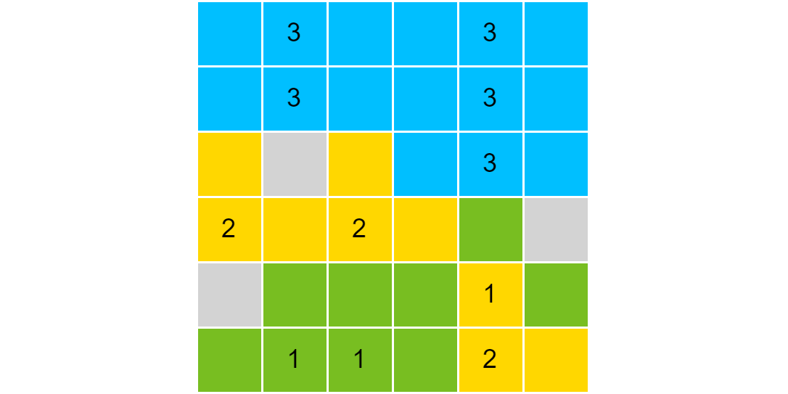

### 2.4. 第 4 关

> 规则

- 在某些位置放置地雷，让 1 到 8 同时出现在网格中。
- 非地雷方块会显示以自身为中心 $3\times 3$ 范围内地雷个数。

> 攻略

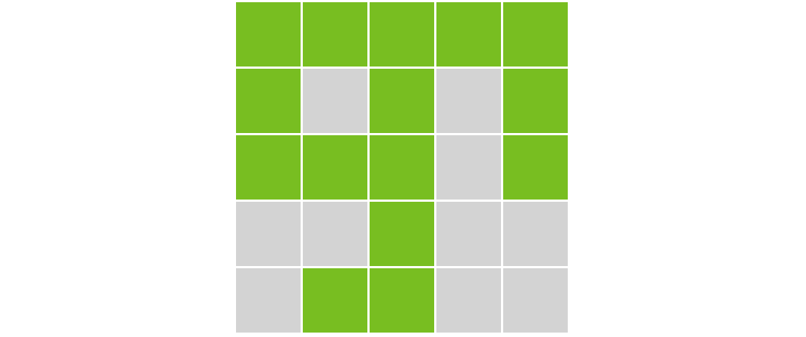

另一种解法：

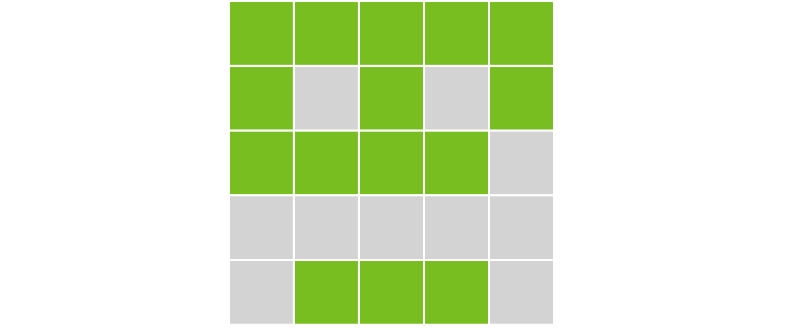

### 2.5. 第 5 关

> 规则

- 完成三次运算，并得到结果 24。
- 初始数字为 1 5 5 5 或者 3 3 7 7。

> 攻略

$$24=(5-1\div 5)\times 5$$

$$24=(3\div 7+3)\times 7$$

> 有彩蛋

### 2.6. 第 6 关

> 规则

- 放置一些障碍，使得存在两个方块距离为 54。

> 攻略

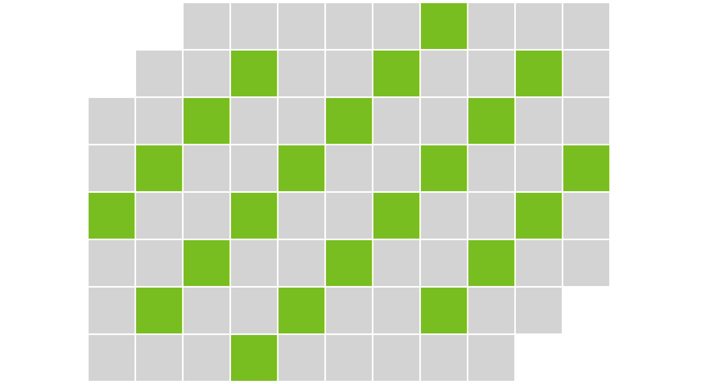

### 2.7. 第 7 关

> 规则

- 至少进行 15 次操作。
- 点击方块后的效果同第二关。

> 攻略

按数字顺序点击：（超额完成）

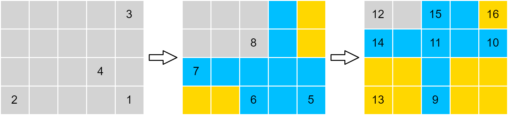

### 2.8. 第 8 关

> 规则

黄色方块可以让分数加一，红色方块可以让分数减一，绿色方块可以让分数乘二。玩家需要让分数恰好等于 2000 分

> 攻略

点击 2 个黄色、5 个绿色、红色、绿色、红色、4 个绿色。

> 原理

$2000=(11111010000)_2=((2^7-1)\times2-1)\times 2^4$。

### 2.9. 第 9 关

> 规则

- 让左侧和右侧看起来完全相同。
- 点击某个方块，除了这个方块外其他所有方块的状态反转（绿色和灰色反转）。

> 攻略

记住一开始左侧和右侧状态相同的方块位置，点一遍。

### 2.10. 第 10 关

> 规则

- 让所有方块消失。
- 只能点击黄色方块。
- 点击 “+” 方块后，该方块消失，以自身为中心 $3\times 3$ 范围的方块都变成黄色。
- 点击 “-” 方块后，该方块消失，以自身为中心 $3\times 3$ 范围的方块都变成灰色。

> 攻略

按数字顺序点击：

## 3. 攻略 11-20

### 3.1. 第 11 关

> 规则

- 放置障碍，使得黄色、蓝色、灰色方块个数均不少于 13。
- 一个非障碍方块的正上方没有障碍，显示黄色。
- 一个非障碍方块的正上方有障碍但是正左方没有障碍，显示蓝色。
- 一个非障碍方块的正上方和正左方都有障碍，显示灰色。

> 攻略

点击所有黑色块：

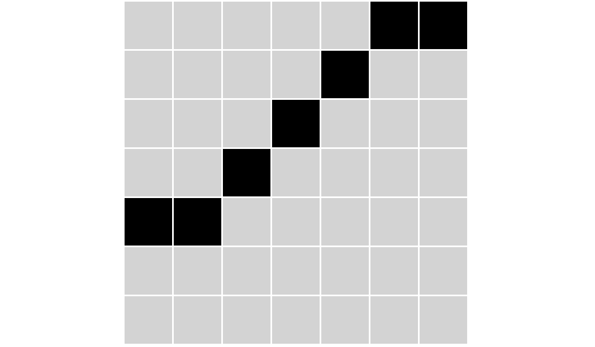

### 3.2. 第 12 关

> 规则

- 让所有绿色方块移动到框内。
- 点击黄色方块可以平移一行 / 列的绿色方块。

> 攻略

按数字顺序点击：

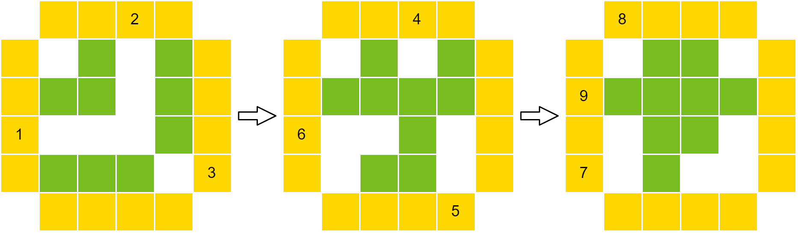

> 扩展

如果初始状态和最终状态反一下该怎么玩。

### 3.3. 第 13 关

> 规则

- 放置不多于 8 个障碍，使得无法填入十字。

> 攻略

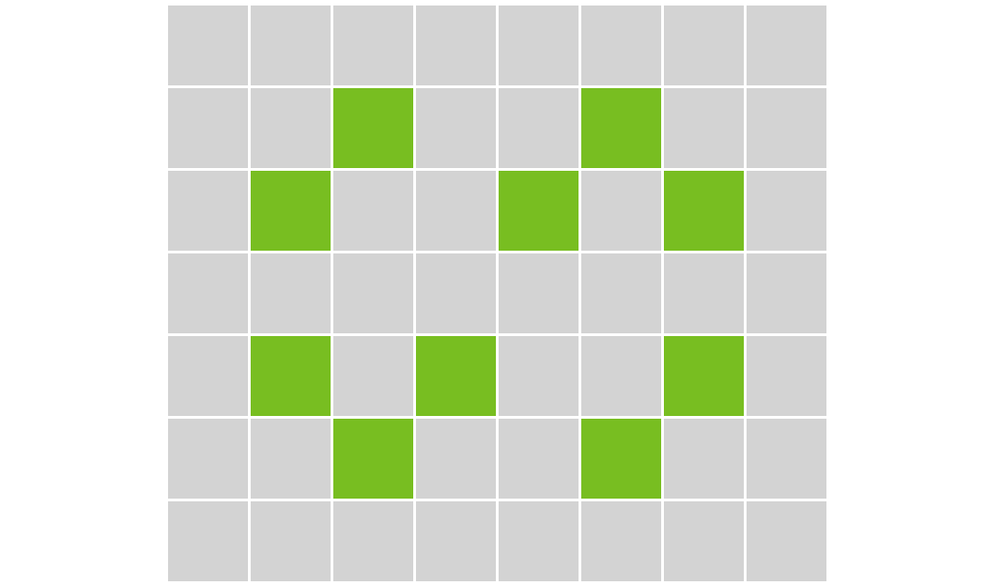

### 3.4. 第 14 关

> 规则

- 让左侧和右侧看起来完全相同。
- 点击灰色方块，该方块和顺时针数第三个灰色方块变黄色。

> 攻略

按数字顺序点击：

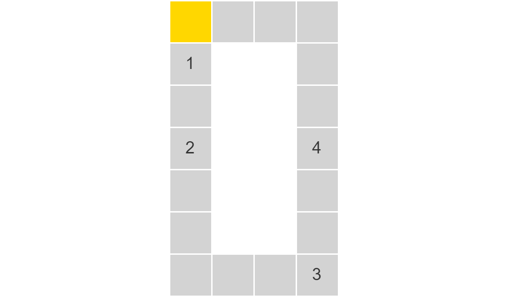

### 3.5. 第 15 关

> 规则

- 让棋盘上的黑色棋子数达到 12。
- 简易的围棋规则。
- 电脑只会在中心对称位置放置一个红色棋子（如果可以的话）。

> 攻略

按数字顺序点击：

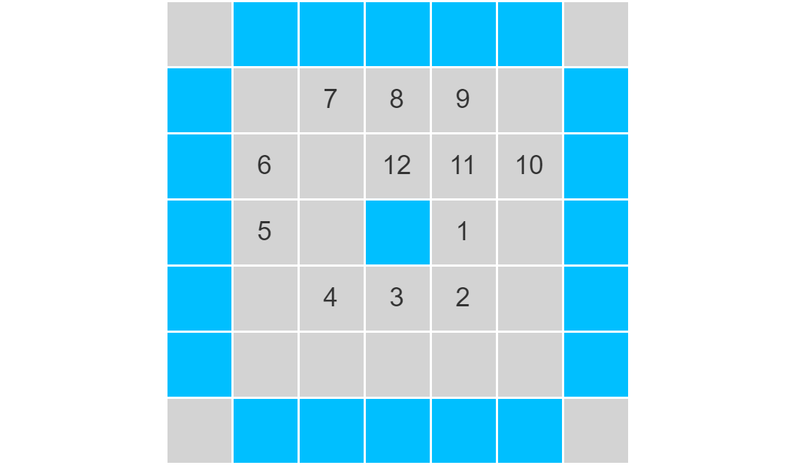

另一种解法：

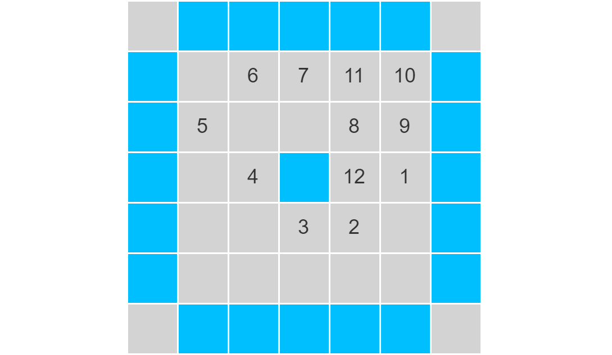

> 扩展

[知乎问题：中心对称下围棋结果是？](https://www.zhihu.com/question/23718395)

### 3.6. 第 16 关

> 规则

- 让方块排列为 1 2 3 4 5 6 7。
- 点击一个方块后，该方块左侧和右侧的所有方块交换。

> 攻略

一开始拼图为 $[...,1,...]$，如果 1 不在最右侧，就要点击 1 右边的方块让拼图变成了 $[...,1]$。然后点击 2，拼图就会变成 $[...,1,2,...]$。

这时候，如果 2 不在最右侧，就要点击 2 右边的方块让拼图变成了 $[...,1,2]$。然后点击 3，拼图就会变成 $[...,1,2,3,...]$。

依次类推。

### 3.7. 第 17 关

> 规则

反应 1：绿 + 绿 → 紫 + 紫 + 紫

反应 2：绿 + 紫 → 红 + 红

反应 3：紫 + 红 → 绿 + 绿 + 紫

反应 4：红 + 红 → (1 得分)

反应 5：红 + 红 + 红 → 红 + 红 + (1 得分)

> 攻略

绿绿绿（反应 1）绿紫紫紫（反应 2）紫紫红红（反应 3）绿绿紫紫红（反应 2）绿紫红红红（反应 2）红红红红红（反应 5）红红红红（反应 5）红红红（反应 5）红红（反应 4）

### 3.8. 第 18 关

> 规则

- 让所有方块变为 0。
- 点击 1 可以变成 2。
- 点击 2 / 3 可以变成 0 并且相邻的四个方格数字加 1（上限 4）
- 点击 4 可以变成 0。

> 攻略

点击所有的 A 后再点击所有的 B。

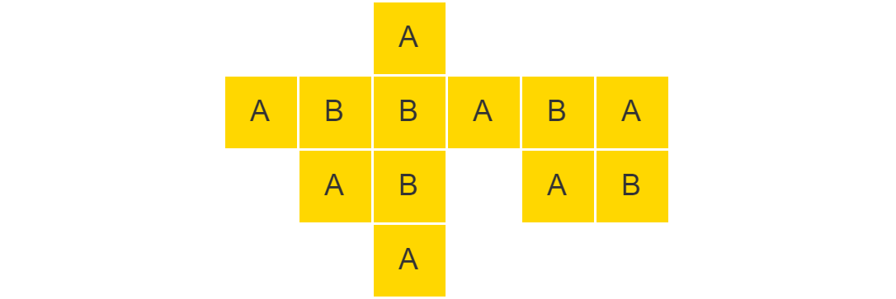

> 原理

找到一些不相邻的方块（攻略里标了 A 的方块），使得其他方块至少与两个这样的方块相邻。

### 3.9. 第 19 关

> 规则

- 让电脑无法操作。
- 玩家与电脑轮流操作。
- 一次操作是选择若干个黄色方块，让它们下降一格，不能不选。

> 攻略

假设最底下一层的高度为 0，玩家每次只要下降所有奇数高度的方块（操作完后所有方格都是偶数高度）。

### 3.10. 第 20 关

> 规则

- 让所有圆形消失。
- 点击方块，会通过圆形移动到方块位置，该圆形上的数字减 1。
- 圆形数字变 0 后消失。
- 绿色方块消失后，标有 “∞” 的方块变为 1。

> 攻略

记第一行三个方块为 A B C，第二行方块为 D。

按顺序点击：B C B A D B A D C B A D C B A D

## 4. 攻略 21-X

### 4.1. 第 21 关

> 规则

- 让标有 “+” 的方块显示蓝色，其他方块显示灰色。
- 点击一个灰色方块，该方块为中心 $3\times 3$ 范围的方块变蓝色。
- 点击一个蓝色方块，该方块为中心 $3\times 3$ 范围的方块变灰色。

> 攻略

按数字顺序点击：

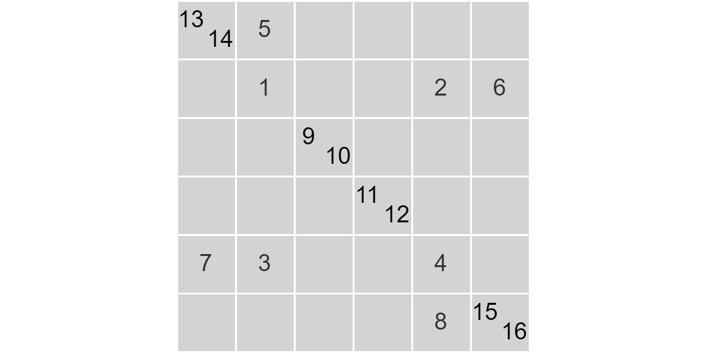

### 4.2. 第 22 关

> 规则

- 在 12 步内找到两个宝藏。
- 点击非宝藏方块会显示到两个宝藏的曼哈顿距离之和。
- 曼哈顿距离定义为横纵坐标之差的绝对值之和。

> 攻略

两个宝藏可以确定一个矩形，这个矩形内所有方格的数字（如果显示的话）都是相同的，而矩形外每一圈数字会加 2。利用这个规律可以用较少步数确定矩形。

> 扩展

其实最多只要 7 步，可以用数学证明。

### 4.3. 第 23 关

> 规则

- 让某一时刻所有车辆都位于 “+” 处。
- 点击车辆可以上锁 / 解锁，并进入下一回合。
- 点击蓝色按钮可以直接进入下一回合。
- 车未被锁住，每回合会向右行驶一格的距离。

> 攻略

按数字顺序点击：

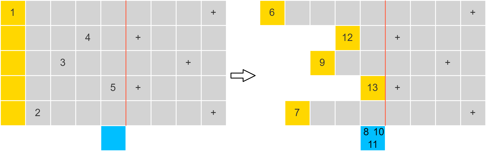

### 4.4. 第 24 关

> 规则

- 给机器人制定指令，让机器人路径覆盖 3 个“+”。
- 指令长度不超过 5。
- 机器人将从起点（左下角）开始重复无数次指令。

> 攻略

依次点击：

另一种解法：

### 4.5. 第 25 关

> 规则

- 放置 12 个蓝色块。
- 蓝色块两两不相邻（允许对角相邻）。
- 灰色块连在一起。

> 攻略

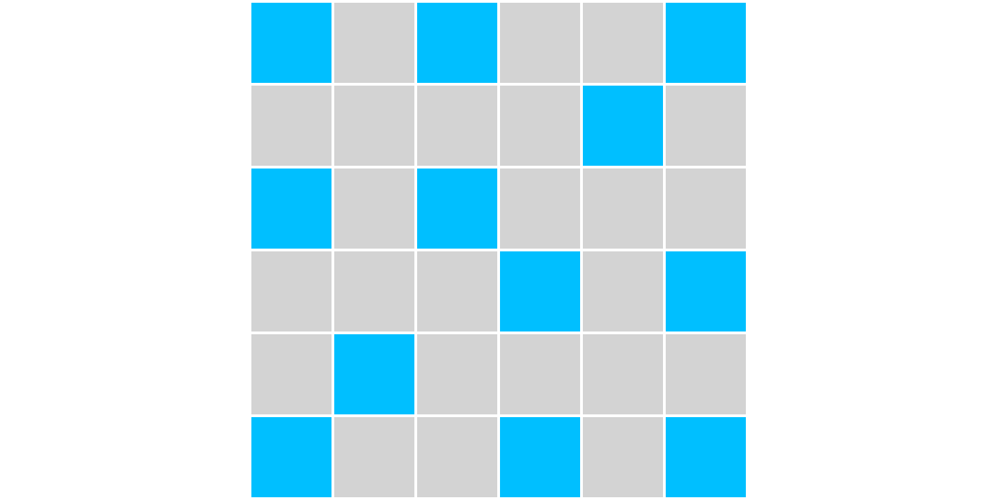

### 4.6. 第 26 关

> 规则

- 吃完所有黄色方块
- 贪吃蛇规则，但是不吃金币蛇身会加长，吃金币不会。

> 攻略

或者：

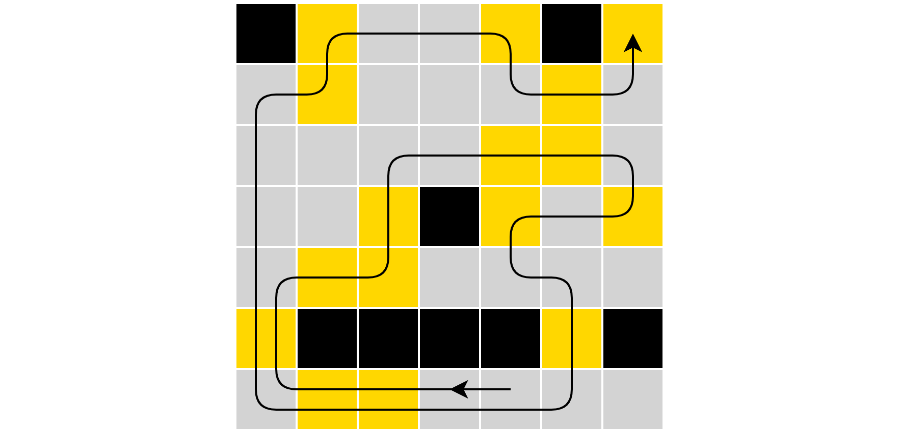

### 4.7. 第 27 关

> 规则

- 走到右下角。
- 向左走数字减 2。
- 向右走数字加 2。
- 向上左数字除以 2。
- 向下走数字乘 2。
- 数字不能为负数，不能大于 4，不能变成小数。

> 攻略

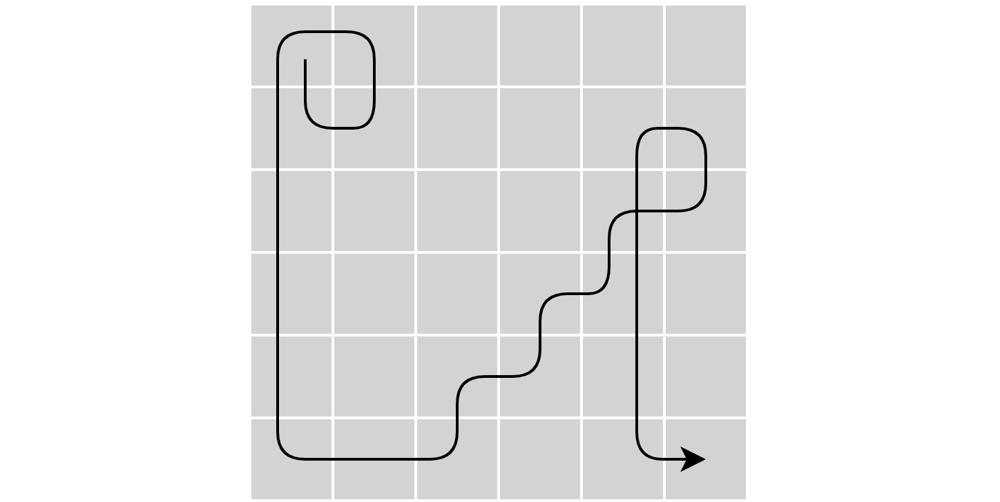

### 第 28 关

> 规则

- 放置 6 个五角星。
- 五角星同行、同列、对角相邻或在同一区块（线条标识内）的区域会填上叉，不能在叉上放置五角星。

> 攻略

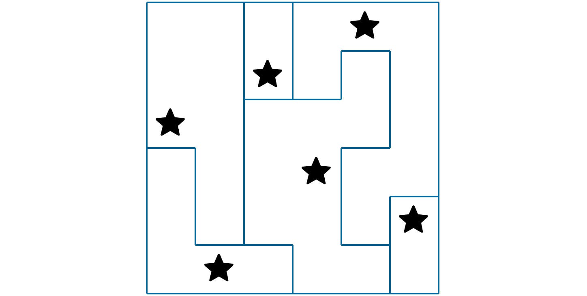

> 扩展

[星之战 - 在线解谜游戏](https://cn.puzzle-star-battle.com/?size=1)

## 第 29 关

> 规则

- 按照标准国际象棋规则移动棋子。
- 每一步都必须吃子。
- 最终只剩下一个棋子。

> 攻略

暂无

> 扩展

[独棋 - 在线解谜游戏](https://cn.puzzle-chess.com/solitaire-chess-6/)

