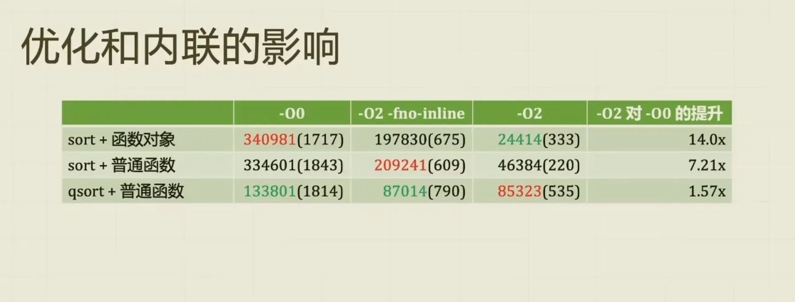
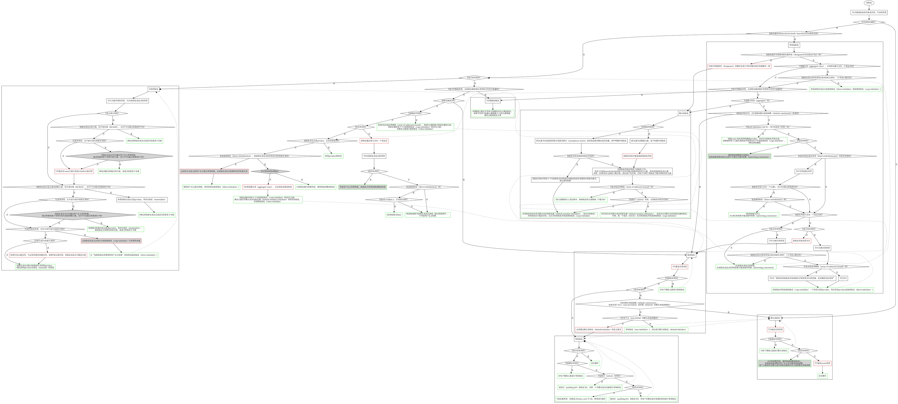

本月的 C++ 话题速览！（2025-04）

## 1. 线程安全随机数和 magic thread_local

往期介绍了 magic static，为了保证线程安全会加锁。magic thread_local（其实这个名字是我编的）也是只进行一次初始化，并且不需要加锁。

推荐线程安全随机数使用这个小寄巧。

```cpp
// 这个代码用了 openmp 的多线程，编译参数要加 -fopenmp
#include <cstdio>
#include <random>

int randint(int min, int max) {
    thread_local std::mt19937 generator(std::random_device{}());
    std::uniform_int_distribution<int> distribution(min, max);
    return distribution(generator);
}

int main() {
#pragma omp parallel
    printf("%d\n", randint(1, 10));
}
```

代码参考：<https://stackoverflow.com/questions/21237905/how-do-i-generate-thread-safe-uniform-random-numbers>

需要注意这个链接里面，函数内变量同时用 static thread_local，static 是多余的，直接用 thread_local 就行了。

## 2. 继承中的 public private 影响内存布局

```cpp
#include <iostream>

struct A1 {
   private:
    int x;
    int y;
    char o;
};

struct B1 : public A1 {
   public:
    char z;
};

struct A2 {
   public:
    int x;
    int y;
    char o;
};

struct B2 : public A2 {
   public:
    char z;
};

int main() {
    std::cout << sizeof(A1) << "\n";
    std::cout << sizeof(B1) << "\n";
    std::cout << sizeof(A2) << "\n";
    std::cout << sizeof(B2) << "\n";
}
```

GCC / Clang 输出 12 12 12 16，MSVC 输出 12 16 12 16（MSVC 很合理，所以这里只讨论 GCC / Clang）。

***

这个问题简单来讲就是，我们**不要**依赖非标准的布局。

这里 B1, B2 都不是标准布局，原因是标准布局有一个要求“继承层级中仅有一个类具有非静态数据成员”（<https://zh.cppreference.com/w/cpp/language/classes>），B1 的继承层级有两个类有成员（即 A1 和 B1），B2 同理，不符合这个要求。

***

那为什么 B1, B2 大小不同呢？原因藏在 Itanium ABI 里。

C++98 定义 POD 要求数据成员都是 public，到了 C++11 才允许 private / protected。而 Itanium ABI 是按照 C++03 对 POD 的定义来的，并且规定了 POD 的 tail padding 不能用于其他用途。<https://itanium-cxx-abi.github.io/cxx-abi/abi.html#pod> 的这句话：

> We ignore tail padding for PODs because the standard before the resolution of CWG issue 43 did not allow us to use it for anything else and because it sometimes permits faster copying of the type.
>
> 翻译：我们忽略 POD 的尾部填充，因为在解决 CWG 问题 43 之前的标准不允许我们将其用于其他任何用途，并且它有时允许更快地复制类型。

因为 A1 有 private 数据成员，即不是 C++03 的 POD，不受 Itanium ABI 的 POD 约束，所以编译器可以为了节省空间把 B1 的内存塞到 tail padding 里（`char z` 紧跟在 `char o` 后面）。A2 是 C++03 的 POD，所以 B2 不能复用 A2 的内存（`char z` 必须单独占 4 字节）。

***

public private 会影响内存布局，这个很反直觉啊。C++ 的坑太多了。

## 3. std::sort 和 qsort 的性能对比

qsort 类型信息损失太多了，根本不够看的。



## 4. 用 constexpr if 实现 std::condition

```cpp
#include <type_traits>

template <bool Cond, typename T1, typename T2>
using CondType = decltype([]() {
    if constexpr (Cond) {
        return T1{};
    } else {
        return T2{};
    }
}());

int main() {
    static_assert(std::is_same_v<CondType<1, int, char>, int>);
    static_assert(std::is_same_v<CondType<0, int, char>, char>);
}
```

但是如果 T1 或 T2 没有默认构造函数怎么办？

可以 `return static_cast<T *>(nullptr)`，在外面 `std::remove_pointer`。

或者 `return std::type_identity<T>{};`，在外面 `::type` 获取类型。

## 5. shared_ptr 传给函数，参数定义为裸指针是否合理

裸指针的语义是借用（即不获得所有权，不析构，和引用是类似的），只要函数保证局部使用，不长期持有，无论如何都不会寄。这样也不会限制 `shared_ptr` 类型，其他指针也能传。

第二种情况是需要长期持有，这时候就需要传参 shared_ptr / weak_ptr 了。

上面的实践需要保证团队里的人都清楚各种指针的语义，但是架不住同事不会啊，所以 ban 了裸指针只传 `shared_ptr` 或者 `shared_ptr&` 也是有道理的。

***

上面对指针的使用建议，可以更扩展一点，就是如果保证指针、引用的生命周期可以被覆盖，这样传指针、引用都是没关系的。

这个地方更极端一点就是，所有同步的场景都可以不用 shared_ptr，生命周期都是可控的。反之多线程、事件驱动异步之类 shared_ptr 就是最佳实践。

## 6. `priority_queue<unique_ptr<T>>` push 进去就出不来了

没错，`top()` 返回值是 `const T&` 无法移动，`pop()` 又没有返回值。

如果强行用 const_cast 并移动出来，就破坏堆的性质了。`pop()` 等函数要满足堆的性质，所以是未定义行为。

建议用 `std::make_heap` 代替 `priority_queue`。

***

事实上所有标准库容器都不能 pop 时把这个元素 move 出来。关于这点，有人搞了 <https://wg21.link/p3182>，这是他们的一次讨论 <https://wg21.link/p3182/github#issuecomment-2171580450>，倾向于做一个 move_if_noexcept。

## 7. 宇宙射线导致内存 bit 翻转

有的，天上的卫星更容易碰到。

之前可以用特制芯片，马斯克搞了多套系统互相纠错的普通硬件：SpaceX 使用的软硬件介绍 <https://www.bilibili.com/video/BV17W411x7V9>。

## 8. C++ 初始化方式

喜欢我 C++ 的初始化吗：



[图片来源](https://www.zhihu.com/question/497428726/answer/2213203090)

其实可以归纳为 <https://www.zhihu.com/question/403578855/answer/1842778970> 所说：

> 1. 可以用 `{}` 初始化，总是用 `{}` 初始化。
> 2. 不能用 `{}` 初始化，用 `=` 初始化。

## 9. 手动实现 typeid

手动实现 typeid 主要为了替代 RTTI（因为 RTTI 有二进制膨胀问题，部分项目会禁止）。

typeid 一般可以用静态局部变量取地址实现。

```cpp
template <typename T>
void* gettypeid() {
    static int x;
    return &x;
}
```

在此基础上可以用虚函数 + CRTP 来完成动态获取 typeid。

```cpp
#include <cstdint>
#include <iostream>

template <typename T>
void* gettypeid() {
    static int x;
    return &x;
}

struct Base {
    virtual void* gettypeid() const = 0;
    virtual ~Base() = default;
};

template <typename Derived>
struct EnableGetTypeId : Base {
    void* gettypeid() const override { return ::gettypeid<Derived>(); }
};

struct Derived1 : EnableGetTypeId<Derived1> {};
struct Derived2 : EnableGetTypeId<Derived2> {};

int main() {
    Derived1 d1;
    Derived2 d2;
    Base* p1 = &d1;
    Base* p2 = &d2;
    std::cout << "Derived1 type_id: " << gettypeid<Derived1>() << std::endl;
    std::cout << "Derived1 dynamic type_id: " << p1->gettypeid() << std::endl;
    std::cout << "Derived2 type_id: " << gettypeid<Derived2>() << std::endl;
    std::cout << "Derived2 dynamic type_id: " << p2->gettypeid() << std::endl;
}
```

## 10. 同一个 shared_ptr 的复制移动 reset 等操作不是线程安全的

（这个话题仔细一想其实很显然）

shared_ptr 使用了原子变量，可能会被误以为同一个 shared_ptr 复制移动是线程安全，实则不然。

例如，A 线程 reset 把引用计数减到 0，然后析构；B 线程恰好在析构前拷贝，就会获得已析构的非法对象，代码如下：

```cpp
shared_ptr<int> a;
// 线程 A
a.reset(new int);
// 线程 B
auto b = a;
```

shared_ptr 的原子变量目的是保证不同 shared_ptr 的并发安全，重点是“不同”。

同一个 shared_ptr 复制、移动、reset 等操作想要线程安全，只靠引用计数的几个原子变量是不行的，需要额外结构。这也是 `atomic<shared_ptr>` 做的事情。
