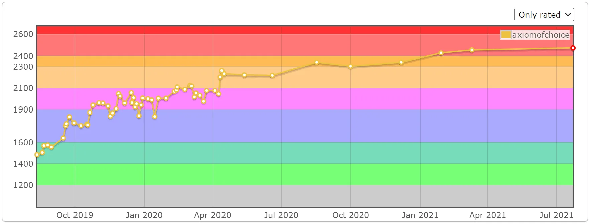
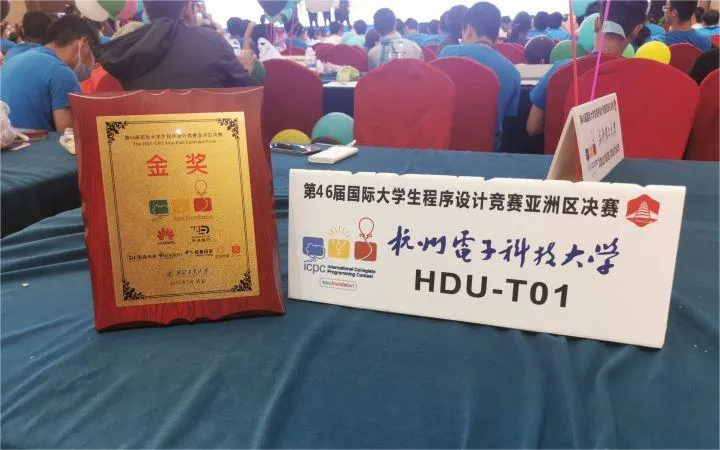

## 1. 你好，我是选择公理

本科杭电，入职华为做 HPC / AI 相关工作。

爱好是学习和分享知识，LOL 大乱斗，写游戏，研究算法。

理想是 965，写 C++，和聪明的人合作。

联系我：[邮箱](mailto:axiomofchoice@163.com) [QQ](https://qm.qq.com/q/o2qw5F5Gp4)。

## 2. 关于这个博客

原博客是 VuePress + Vdoing，我用 AI 把它迁移到了 VitePress，花了很多时间调细节。

## 3. 分享知识

一个技术爱好者。

[ACM 竞赛板子](https://github.com/axiomofchoice-hjt/ACM-axiomofchoice/)

[败犬日报 | C++ 话题每日推送](https://makeinu-daily.pages.dev/)

以及 C++、性能优化、算法为主的文章，代表作：

[浮点数误差入门](/pages/c1e151/)

[集合求并的极致优化](/pages/85c4ed/)

## 4. 一个前 ACMer

