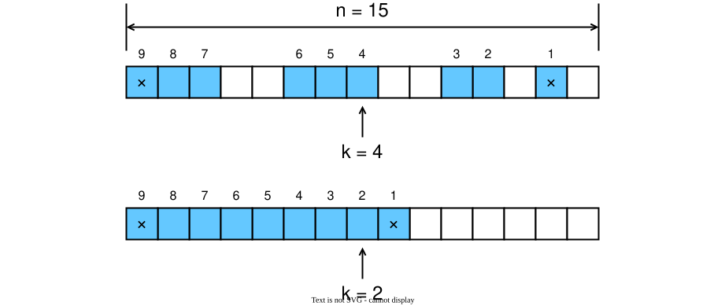
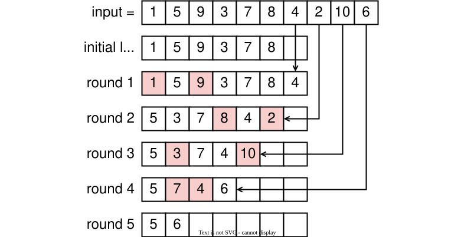
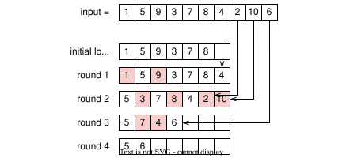
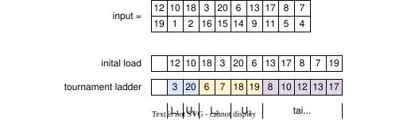
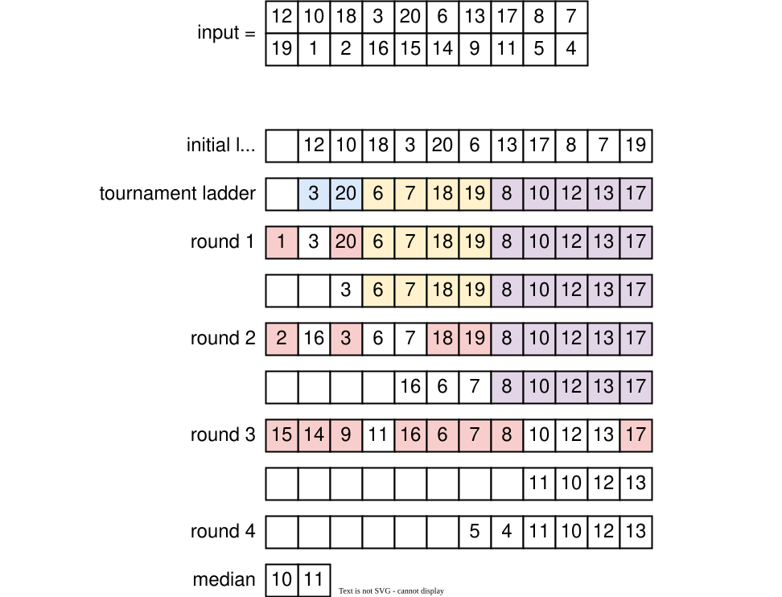

这次的神秘算法是：知道输入数组大小 n，只能遍历一遍输入数组，如何在 $\lfloor \frac{n}{2} \rfloor + 2$ 额外空间、线性时间复杂度的限制下求中位数。

参考论文：

1. A Minimal Space Selection Algorithm That Runs in Linear Time 这个论文研究中位数问题。似乎没有 DOI 号，所以我不加论文链接了。
2. [Time and space bounds for selection problems](https://doi.org/10.1007/3-540-08860-1_15) 这个论文研究选择 (Top-K) 问题。

第一篇论文是 1977 年的，当时还有磁带这个东西。只读、只能顺序遍历，倒带的代价比较大，这个算法看起来会合理一些。现在的硬盘可以随机访问，这个算法也基本只剩图一乐了。

## 1. 前置算法

### 1.1. 区间旋转

把两个相邻区间 `[A B]` 原地变成 `[B A]`，保持区间内部顺序不变。经典的做法是三次翻转法（或手摇算法），这里就不展开了。

代码里直接调用标准库的 `std::rotate`，复杂度 $O(n)$。

### 1.2. 选择算法

选择算法就是求第 k 小的数，在我之前的文章《O(n) 原地选择的不稳定版本》讲过 BFPRT 和消除递归栈版本的 BFPRT，这里可以当成黑盒调用。

代码里直接用了 `std::nth_element` 作为 stub 调用。

```cpp
template <typename RandomIt, typename Proj = std::identity>
void select_stub(RandomIt first, RandomIt mid, RandomIt last, Proj proj = {}) {
    std::ranges::nth_element(first, mid, last, {}, proj);
}
```

## 2. 最小空间中位数算法

我们假设 n 是偶数时，n 个数里排名最中间的两个数都是中位数。

### 2.1. 引理

n 个数里任选 $\lfloor \frac n 2 \rfloor + 1 + i$ 个数，它们的最小 i 个数和最大 i 个数一定不是中位数。

证明一下，首先 n 是奇数时，n 个数里比中位数小的数有 $\lfloor \frac n 2 \rfloor$ 个。

如果任选数里第 k 大的数是中位数，在任选数里比中位数小的个数就是 $\lfloor \frac n 2 \rfloor + 1 + i - k$，于是有：

$$\lfloor \frac n 2 \rfloor + 1 + i - k \le \lfloor \frac n 2 \rfloor$$

化简：

$$k \ge i + 1$$

因此，如果任选数里有中位数，那么最大 i 个数一定不是中位数。对称可知，最小 i 个数也是一样。



***

n 是偶数时，n 个数里比**上中位数**小的数最多 $\lfloor \frac n 2 \rfloor$ 个。

如果第 k 大的数是**上中位数**，在任选数里比它小的个数就是 $\lfloor \frac n 2 \rfloor + 1 + i - k$，于是有：

$$\lfloor \frac n 2 \rfloor + 1 + i - k \le \lfloor \frac n 2 \rfloor$$

化简：

$$k \ge i + 1$$

因此对**上中位数**可证，下中位数也是差不多的证明过程。

### 2.2. 算法思路

我们有 $\lfloor \frac n 2 \rfloor + 2$ 大小的缓冲区，正好对应引理 $i = 1$ 的情况。

因此很快能想到一个初步思路，先读 $\lfloor \frac n 2 \rfloor + 1$ 个数到缓冲区里。此时缓冲区还空 1 个位置，之后不断读 1 个数并淘汰 1 个最小值和 1 个最大值，最后就恰好剩下中位数。



但问题是，我们做不到维护一个结构，可以 $O(1)$ 完成插入、查询或删除最小最大值。因为能做到就能完成 $O(n)$ 的比较排序了（比较排序下界是 $O(n\log n)$）。

并且除了元素只能申请 $O(1)$ 的额外内存，加了这个要求可能连 $O(\log n)$ 都很难做到。

***

我们发现，第 1 轮淘汰后，空出来的位置有 2 个。于是第二轮淘汰时，可以读 2 个数，淘汰 2 个最小值和 2 个最大值。这样空出来的位置会指数上升，第 k 轮淘汰后，缓冲区会空出 $2^k$ 个位置。

大概证明就是由于第 k 轮之前淘汰了 $2^1+2^2+...+2^{k-1}=2^k-2$ 个数，所以第 k 轮对应引理 $i=2^{k-1}$ 且 n 减少 $2^k-2$ 的情况。



***

那么这有什么用呢？这就是算法最核心的地方了。

一开始读 $\lfloor \frac n 2 \rfloor + 1$ 个数后，我们先求 1 个最小值 $L_1$、1 个最大值 $U_1$，剩下的数求 2 个最小值 $L_2$、2 个最大值 $U_2$，剩下的数求 4 个最小值 $L_3$、4 个最大值 $U_3$，按等比数列类推。



到了淘汰阶段，第一轮读 1 个数，它和 $L_1,U_1$ 放一起（3 个数），并淘汰这里的 1 个最小值 1 个最大值。显然缓冲区剩下的数都夹在 L_1、U_1 之间，不可能出现最小或最大值。

第一轮有 2 个数淘汰，1 个数晋级。

第二轮淘汰，读 2 个数，它们和晋级的那个数、$L_2,U_2$ 放一起（7 个数），并淘汰这里的 2 个最小值 2 个最大值。同样缓冲区剩下的数都夹在 $L_2,U_2$ 之间，不可能出现最小 2 个或最大 2 个值。

第二轮有 4 个数淘汰，3 个数晋级。

第 i 轮也是按等比数列类推。读 $2^{i-1}$ 个数，它们和前一轮晋级的 $2^{i-1}-1$ 个数、$L_i,U_i$ 放一起（一共 $2^{i+1}-1$ 个数），并淘汰这里的 $2^{i-1}$ 个最小值 $2^{i-1}$ 个最大值。



***

算法大致思路就是这样，对于边界的处理，我在后文实现的时候再说。

### 2.3. 复杂度分析

初始化求 $L_1, U_1, L_2, U_2, ...$，我们需要反过来计算，就是从排名中间的大区间再到两边的小区间。最大的两个区间大小大约是 $\lfloor \frac n 2 \rfloor$，把它们处理好后，剩下的范围直接减半。求区间本身是两次线性时间的选择算法，因此复杂度是一个等比数列 $O(n) + O(\frac n 2) + O(\frac n 4) + ...=O(n)$。

淘汰阶段，第 i 轮要处理 $2^{i+1}-1$ 个数，淘汰本身就是两次线性时间的选择算法，所以复杂度也是个等比数列 $O(1) + O(2) + O(4) + ... + O(n)=O(n)$。

最终复杂度 $O(n)$。

## 3. 实现最小空间中位数算法

理论可行，实践开始。

### 3.1. 选择一个区间

辅助函数，选择算法执行两次把一个区间划分出来。

```cpp
template <typename RandomIt, typename Proj = std::identity>
void select_range(RandomIt first, RandomIt left, RandomIt right, RandomIt last, Proj proj = {}) {
    if (left != last) {
        select_stub(first, left, last, proj);
    }
    if (right != last) {
        select_stub(left, right, last, proj);
    }
}
```

### 3.2. 中位数算法

还是辅助函数，如果所有候选者都在缓冲区了，直接 `select_range` 把中位数求出来。

```cpp
template <typename RandomIt, typename Proj = std::identity>
std::array<std::iter_value_t<RandomIt>, 2> median(RandomIt first, RandomIt last, Proj proj = {}) {
    int64_t size = last - first;
    assert_or_throw(size > 0);
    if (size > 2) {
        select_range(first, first + ((size - 1) / 2), first + (size / 2) + 1, last, proj);
    }
    std::array<std::iter_value_t<RandomIt>, 2> result = {first[(size - 1) / 2], first[size / 2]};
    if (proj(result[0]) > proj(result[1])) {
        std::swap(result[0], result[1]);
    }
    return result;
}
```

### 3.3. 初始化阶段

先读 `n / 2 + 1` 个数。

```cpp
for (int64_t i = 0; i < (size / 2) + 1; i++) {
    buffer_first[i + 1] = next();
}
```

每次 `select_range` 中间一个区间，把该区间旋转到后面。做完后，从左往右正好是 $L_1,U_1$ 混一起的区间，$L_2,U_2$ 混一起的区间，等等。

结尾会有不足 $L_i,U_i$ 大小的几个数，放最后面。

```cpp
BufferIt left = buffer_first + 1;
BufferIt right = buffer_last;
for (int64_t ladder_size = max_ladder_size; ladder_size > 0; ladder_size /= 2) {
    int64_t n_keeps = (ladder_size - 1) * 2;
    assert_or_throw(n_keeps < right - left);
    select_range(left, left + (n_keeps / 2), right - (n_keeps / 2), right, proj);
    right = std::rotate(left + (n_keeps / 2), right - (n_keeps / 2), right);
}
assert_or_throw(left == right);
```

### 3.4. 淘汰阶段

每一轮都尽可能多读，就是一直读到输入数组的末尾，或者缓冲区空位置填满。此时如果读完了，可以直接用 `median` 函数得到结果，结束算法。

淘汰数量就是读取量的 2 倍，处理数量是读取量的 4 倍减 1，或者整个缓冲区。

```cpp
BufferIt candidates = buffer_first + 1;
while (true) {
    int64_t n_loads = std::min(remain, candidates - buffer_first);
    for (int64_t i = 0; i < n_loads; i++) {
        candidates--;
        *candidates = next();
    }
    if (remain == 0) {
        break;
    }
    int64_t n_drops = n_loads * 2;
    int64_t n_candidates = std::min((n_loads * 4) - 1, buffer_last - candidates);
    if (n_candidates == buffer_last - candidates) {
        assert_or_throw(n_candidates >= n_drops + (size % 2 == 0 ? 2 : 1));
    }
    BufferIt left = candidates;
    BufferIt right = buffer_first + n_candidates;
    select_range(left, left + (n_drops / 2), right - (n_drops / 2), right, proj);
    candidates = std::rotate(left + (n_drops / 2), right - (n_drops / 2), right);
}
return median(candidates, buffer_last, proj);
```

## 4. 稳定化改造

稳定的中位数算法，计算结果等价于稳定排序后取中间元素。

很显然，上面介绍的算法是是不稳定的，那么能不能保留算法框架，让它稳定呢？很不幸，不能。

大致讲一下我的直觉。因为在淘汰阶段，我们期望淘汰的最小值“相同数初始位置靠前”，因此 $L_i$ 必须比后面数的“相同数初始位置靠前”。但是读进来的数比缓冲区任何数都“相同数初始位置靠后”，它们和 $L_i$ 混在一起就无法区分了。

***

但是如果重新设计算法，是否可以稳定，我不敢下定论。我尝试搜了论文没找到，毕竟只是小众领域，也很正常。

## 5. 完整代码

[完整实现](https://github.com/axiomofchoice-hjt/TCS-Algorithms/blob/master/include/tcs/readonly/onepass_median.hpp)和[测试](https://github.com/axiomofchoice-hjt/TCS-Algorithms/blob/master/tests/readonly/test_onepass_median.cpp)。

## 6. 最小空间选择问题

第二篇论文探讨了更一般的问题，就是只遍历一遍的选择 (Top-K) 问题。如果求第 k 大的数 $k\le \frac n 2$，结论是最小空间 k + 1，时间复杂度不会小于 $O(n\log k)$。显然，维护一个大根堆就可以了。

可以看到，中位数能做到 $O(n)$，是一个例外。

论文又指出，如果最小空间是 $k + \epsilon n, \epsilon > 0$，选择问题的复杂度就能达到线性。只要不断地填充缓冲区，用 BFPRT 保留 k 个最大值即可。

这些结论比较平凡，也很好证明，就不展开了。

## 7. 结尾

讲起来很绕，实现只用了大约 100 行，还是比较简洁的。

这篇文章用到了一种特殊的 RAM 计算模型，输入是只读且顺序访问。这种模型里有点意思的论文，可能只有中位数算法了。

但是只读算法还有两个计算模型，一个是输入允许多趟顺序访问，另一个的输入直接允许随机访存。这样的选择、排序算法就非常有意思了，要写好几篇文章，我打算新建一个只读算法系列来讲讲。
